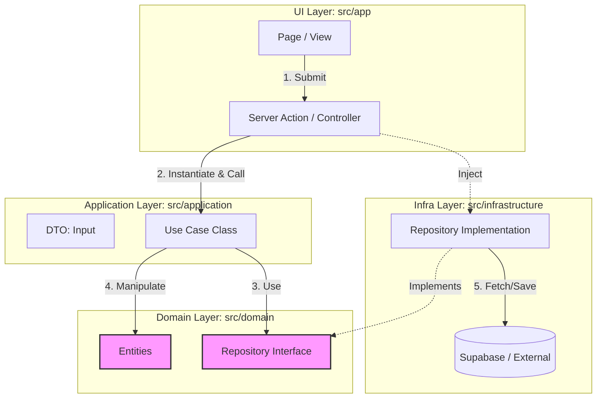

# Development Guidelines (v1.0)

## 1. Application Architecture (Clean Architecture / Onion)

開発の効率性と保守性を最大化するため、**厳格なクリーンアーキテクチャ（Onion Architecture）**を採用する。
記述量が増える「ボイラープレート」のコストよりも、**「関心事の分離」**と**「依存方向の厳守」**を最優先する。

### 1.1. Core Philosophy

- **Use Case層の導入:** UIとロジックを完全に切り離し、実装単位（Context）を明確にする。
- **DIP (Dependency Inversion Principle) の徹底:** `Domain` 層にインターフェースを置き、`Infrastructure` 層がそれを実装する。

### 1.2. Directory Structure

```text
src/
├── app/                      # [UI Layer] Next.js App Router (Pages, Layouts)
│   ├── _actions/             # Server Actions (Controller / Entry Point)
│   └── (routes)/             # 各画面のルーティング
├── components/               # [UI Layer] React Components (Pure View)
│   ├── ui/                   # [Generic] 汎用 UI (Button, Card, Skeleton) - ロジック/依存なし
│   ├── layout/               # [Structure] アプリ固有レイアウト (Header, Footer) - Auth/Lang依存あり
│   ├── player/               # [Feature Layer] Player機能コンポーネント
│   ├── content/              # [Feature Layer] Content機能コンポーネント
│   └── score/                # [Feature Layer] Score機能コンポーネント
│
├── domain/                   # [Domain Layer] ★最重要・外部依存ゼロ
│   ├── [feature]/            # 機能単位でカプセル化 (例: player, content)
│   │   ├── [Feature].ts     # 型定義・Schema (例: Content.ts)
│   │   ├── [Feature]Repository.ts # リポジトリIF (例: ContentRepository.ts)
│   │   └── [Feature]Constants.ts  # 定数 (例: PlayerConstants.ts)
│   └── shared/               # 汎用定義 (Logger, Shared Types)
│
├── application/              # [Use Case Layer] アプリケーションの機能単位
│   ├── [feature]/            # 機能単位でカプセル化 (例: player, content)
│   │   ├── [Feature]UseCase.ts
│   │   └── [Feature]Dto.ts
│
├── infrastructure/           # [Infra Layer] 技術的詳細・外部連携
│   ├── [feature]/            # 機能単位 (例: content)
│   │   └── Fs[Feature]Repository.ts # 実装クラス
│   ├── database/             # 共有DB接続 (Supabase Client, Prisma)
│   └── external/             # 外部APIクライアント (Stripe, Gemini)
│
└── lib/                      # [Shared] 汎用ユーティリティ
```

### 1.3. Layers Definition & Responsibilities

#### Domain Layer (`src/domain/`)

- **役割:** ビジネスの「用語」「ルール」「契約（インターフェース）」を定義する。
- **アーキテクチャ:** **Package by Feature (機能単位)** を採用する。技術的なレイヤー分け（Entity, Repository）ではなく、ビジネス機能（Player, Content）でフォルダを分け、凝集度を高める。
- **ルール:** 他のいかなる層（Application, Infra, UI）にも依存してはならない。
- **構成例 (`src/domain/content/`):**
  - `Content.ts`: データ構造 (Entity, Value Object) と バリデーションルール (Zod Schema) を**同じファイルに定義**（Colocation）。
  - `ContentRepository.ts`: データアクセスのインターフェース (Repository Interface)
  - **命名規則:** `models.ts` などの汎用名ではなく、`Feature.ts` (機能名そのもの) を使用する。検索性と文脈理解を優先するため。
- **Performance Pattern:** 大きなデータを持つEntityは、一覧取得時のパフォーマンス劣化を防ぐため、**Summary型（軽量）**と**Detail型（重量）**に分割定義することを推奨する。

#### Application Layer (`src/application/`)

- **役割:** ユーザーが「何をしたいか（ユースケース）」を表現する。
- **アーキテクチャ:** **Package by Feature (機能単位)** を採用する。
- **構成例 (`src/application/content/`):**
  - `GetContentDetailUseCase.ts`: ドメイン層のInterfaceを使って処理フローを記述する。
  - `ContentDto.ts`: UI層とやり取りするための単純なデータ型 (Zod Schema含む)。
- **実装のポイント:** 「Repository Interfaceを使って、〇〇を行うビジネスロジックを実装する」
  - **Validation Rule:** DTOの定義には必ず **Zod Schema** を併記し、型定義は `z.infer` から生成する。
    ```ts
    // src/application/user/UserDto.ts
    import { z } from 'zod';
    export const UserSchema = z.object({ name: z.string().min(1) });
    export type UserDto = z.infer<typeof UserSchema>;
    ```

#### Infrastructure Layer (`src/infrastructure/`)

- **役割:** ドメイン層で定義されたInterfaceを、具体的な技術（Supabase, API）で実装する。
- **アーキテクチャ:** **Package by Feature (機能単位)** を採用する。ただし、DB接続設定や共通外部APIクライアントは `database/` や `external/` に配置する。
- **構成例 (`src/infrastructure/content/`):**
  - `FsContentRepository.ts`: `IContentRepository` のファイルシステム実装。
- **ルール:** ここを変更しても、DomainやApplication層のコードを変えてはならない。
- **実装のポイント:** 「Supabaseを使って `IUserRepository` の実体クラスを作成する」

#### UI Layer (`src/app/`, `src/components/`)

- **役割:** データの表示とユーザー入力の受付。
- **Server Actions:** コントローラーとして機能する。ここで「依存性の注入（DI）」を行い、Use Caseを実行する。
  - **Validation Rule:** Actionの冒頭で必ず `Schema.safeParse()` を実行し、不正な入力はドメイン層に渡す前に弾く。

### 1.4. Architecture Diagram & Data Flow

依存の矢印 `-->` は常に **内側（Domain）** に向かう。



### 1.5. Development Workflow

以下の順序で実装を進めることで、依存関係の混乱を防ぐ。

1.  **Phase 1: Domain Definition** (`src/domain` Entity & Interface)
2.  **Phase 2: Use Case Implementation** (`src/application` Business Logic)
3.  **Phase 3: Infrastructure Implementation** (`src/infrastructure` DB/API Adapter)
4.  **Phase 4: UI Connection** (`src/app` Server Action & View)
5.  **Phase 5: Verification & Refinement** (Unit/Component/E2E Tests & UI Polish)

### 1.6. Component Categorization (UI vs Layout)

`src/components` 内のフォルダ分けにおいて、特に混同しやすい `ui` と `layout` の境界を以下のように定義する。

| フォルダ    | 役割・定義                                                                                                           | 特徴 (Criteria)                                                                                                                | 例                                             |
| :---------- | :------------------------------------------------------------------------------------------------------------------- | :----------------------------------------------------------------------------------------------------------------------------- | :--------------------------------------------- |
| **ui/**     | **Generic Atoms (汎用部品)**<br>プロジェクトに依存しない、純粋なUIパーツ。他プロジェクトへのコピー＆ペーストが可能。 | ・**No Domain Logic:** ビジネスロジックを持たない<br>・**No Auth:** 認証状態を知らない<br>・**No Fetch:** データ取得を行わない | `Button`, `Card`, `Skeleton`, `Dialog`         |
| **layout/** | **Structure (構造部品)**<br>アプリの骨格を成す部分。特定のドメインや状態に依存する。                                 | ・**Context Aware:** ユーザー情報や言語設定(`lang`)に依存する<br>・**Business Logic:** ナビゲーションの制御などを含む          | `Header`, `Footer`, `Sidebar`, `ConsentBanner` |

## 2. Coding Standards

**Google TypeScript Style Guide** をベースとし、以下の独自ルールを追加適用する。

### 2.6. Feature Component Patterns (Role-based Naming)

「Package by Feature」構成内で、コンポーネントの役割（責務）を明確にするため、以下の命名規則を推奨する。

| 役割 (Role)    | 責務・定義                                                                                                            | 命名規則 (Suffix)  | 例 (Player)                                     |
| :------------- | :-------------------------------------------------------------------------------------------------------------------- | :----------------- | :---------------------------------------------- |
| **View (UI)**  | **[Default]**<br>ユーザーが見て操作するもの。<br>ロジックを持たず、Props/Contextの命令を呼ぶのみ。                    | **なし**<br>(標準) | `FocusAudioPlayer.tsx`<br>`MiniAudioPlayer.tsx` |
| **Controller** | **[Headless]**<br>画面を持たない（`null`を返す）。<br>ContextとView、View同士の調整、ライフサイクル管理を行う。       | **Controller**     | `AudioPlayerController.tsx`                     |
| **Adapter**    | **[Interface]**<br>外部ライブラリやInfrastracture層との接続口。<br>アプリ内のProps体系を外部サービス仕様に変換する。  | **Adapter**        | `AudioPlayerAdapter.tsx`                        |
| **Feature**    | **[Entry Point]**<br>機能の公開エントリーポイント。<br>実装詳細（Client Wrapper等）を隠蔽し、使いやすいIFを提供する。 | **Feature**        | `AudioPlayerFeature.tsx`                        |

**適用ルール:**

- ファイル数が増え、役割が曖昧になり始めた場合に導入する。
- 小規模な機能では標準名（Suffixなし）で開始して良い。

### 2.7. Naming Scope Policy (Package vs Component)

**「フォルダ名（Package）は広く、ファイル名（Component）は具体的に」** という方針を採用する。

- **Package Name (Folder):** 将来的な拡張性（Extensibility）を考慮し、**広義のドメイン名**を採用する。
  - Good: `src/components/player/` (将来 `VideoPlayer` や `ScorePlayer` が増えても格納できる)
  - Bad: `src/components/audio-player/` (音声専用に限定され、構成変更に弱くなる)
- **Component Name (File):** 役割を明確にするため（Specificity）、**具体的かつ詳細な名前**を採用する。
  - Good: `AudioPlayerController.tsx` (「音声」プレイヤーであることが自明)
  - Bad: `PlayerController.tsx` (何のプレイヤーか文脈依存になる)

### 2.8. Constants & Configuration

- **Centralization:** アプリ全体で共通の定数（サイト名、Base URL、ロケール定義など）は、**`src/lib/constants.ts`** に集約する。
- **No Magic Strings/Numbers:** 本番URLや特定のタイムアウト値などをコード中にハードコーディングすることを禁止する。
  - **Env Vars:** 環境依存の値は `process.env` から取得し、`constants.ts` 内で適切なフォールバック値と共に定義する。
  - **Shared:** 複数のファイルから参照される値は必ず定数化する。

### 2.9. Naming Conventions (Casing Policy)

コードの役割（UI、ロジック、設定）を直感的に判別し、OS間のビルド事故を防ぐため、以下のケース使い分けを厳守する。

#### 2.9.1. Filenames & Directory Names

| ケース         | 適用対象                                                                                                                                                                                                                                                                   | 例                                                                                              |
| :------------- | :------------------------------------------------------------------------------------------------------------------------------------------------------------------------------------------------------------------------------------------------------------------------- | :---------------------------------------------------------------------------------------------- |
| **PascalCase** | **UIコンポーネント (React)**<br>JSXで使用されるコンポーネントファイル。                                                                                                                                                                                                    | `Header.tsx`, `ArticleList.tsx`, `Button.tsx`                                                   |
| **kebab-case** | **ロジック（Domain, Application, Infrastructure）、設定、ユーティリティ**<br>原則としてケバブケース（ハイフン区切り）を使用する。<br>また、役割（Repository, UseCase等）を表すサフィックスは**ドット(`.`)区切り**とすることを推奨する（Feature-Sliced / NestJSスタイル）。 | `article.repository.ts`<br>`get-article.use-case.ts`<br>`user-profile.ts`<br>`app.constants.ts` |

#### 2.9.2. Code Elements

| ケース              | 適用対象                                                                       | 例                                                                          |
| :------------------ | :----------------------------------------------------------------------------- | :-------------------------------------------------------------------------- |
| **PascalCase**      | 型 (Type), インターフェース (Interface), クラス (Class), Reactコンポーネント名 | `interface User { ... }`, `class AppError ...`, `function Header() { ... }` |
| **camelCase**       | 変数 (Variable), 関数 (Function), インスタンス名                               | `const user = ...`, `function fetchData() { ... }`, `const supabase = ...`  |
| **SCREAMING_SNAKE** | 定数 (Constants)                                                               | `export const SITE_NAME = '...'`                                            |

### 2.1. TypeScript & JavaScript

- **TypeScript:** `strict: true` を必須とする。`any` 型の使用は原則禁止（`unknown` を使用し、型ガードを行う）。
- **Immutability:** 変数は可能な限り `const` を使用し、再代入可能な `let` の使用を避ける。
- **Functional:** `for` ループよりも `map`, `filter`, `reduce` 等の高階関数を使用する。

### 2.2. React / Next.js Best Practices

- **Hooks Rules:**
  - **Prefix:** Custom Hooksは `use` で始める。
  - **Logic Separation:** 複雑なロジック（Effect, State Management）はコンポーネント内にベタ書きせず、`useYourLogic.ts` に切り出して責務を分離する（Colocation）。
- **Component Definition:**
  - `function` キーワードを使用する（アロー関数 `const Component = () => {}` は、Propsの型定義が見づらくなるため避ける）。
  - **Props:** 必ず `interface` で定義し、エクスポートする。`React.FC` は使用しない。
  - **Export:** 原則として **Named Export** (`export const Component = ...` または `export function ...`) を使用する。
    - **Reason:** リファクタリング時の自動リネームを確実にするため、およびTree Shaking効率化のため。
    - **Exception:** Next.jsの `page.tsx`, `layout.tsx` 等は `export default` が必須のため例外とする。
- **Server vs Client:**
  - データフェッチは Server Component で行う。
    - **Reason:** クライアントへAPIキーやDB接続情報を露出させないため（Security）、およびJSバンドルサイズを削減するため（Performance）。VercelなどのServerless環境でも動作する。
  - `use client` はツリーの末端（Leaf）で使用し、サーバーレンダリングの恩恵を最大化する。
  - **Async Params (Next.js 15+):**
    - Pageコンポーネントの `params` および `searchParams` は **Pomise** として提供されるため、必ず `await` してからアクセスする。
    - Bad: `const slug = params.slug;`
    - Good: `const { slug } = await params;`
  - Image Optimization: `next/image` を使用し、レイアウトシフト（CLS）を防ぐ。
  - **Client-Only Library Integration (The Wrapper Pattern):**
    - **Context:** `window` / `document` に依存するライブラリ（例: `abcjs`, `leaflet`）をServer Componentから直接インポートするとビルドエラーになる。
    - **Rule:** 以下の3ファイル構成（Wrapper Pattern）を標準とする。
      1.  `FeatureRenderer.tsx`: ライブラリを直接使用する実装（`'use client'`）。
      2.  `FeatureClientWrapper.tsx`: `dynamic(() => import('./FeatureRenderer'), { ssr: false })` を行い、ローディング中のスケルトン（`loading`）を提供する。
      3.  `index.tsx`: **Wrapperをデフォルトエクスポート** する。
      - **Rationale:** 利用側（Server Component）は `import Feature from '@/components/features/xxx'` とするだけで、CSR限定実行とLoading UIが自動的に適用され、安全かつクリーンに保たれる。

### 2.2.2. Component Design & Contracts (Design First)

UIコンポーネント間、あるいはロジックとUIをつなぐ重要なデータ構造（例: `AudioMetadata`や複雑なProps）は、実装に着手する前にDesign Doc等で**Interface定義**を行い、関係者（AI含む）間で合意（Contract）を形成する。

- **Benefits:** 「呼び出し元が `author` を渡しているのに、コンポーネントは `composer` を待っている」といった連携ミス（Interface Mismatch）を未然に防ぐ。

### 2.2.3. Context & State Refactoring Safety

Global State (Context) の型定義を変更する際（フィールド追加・削除・リネーム）は、**すべてのConsumer（利用者）を検索し、Destructuring（分割代入）の記述漏れがないか確認する**ことを義務付ける。

- **Risk:** TypeScriptの型定義だけ更新しても、Consumer側で `const { oldField } = useCtx()` のように古いフィールドを参照していたり、新しい必須フィールドを取り出し忘れていると `ReferenceError` や `undefined` バグにつながる。

### 2.2.1. Hydration & SSR Safety (Update from PR #3)

Next.js (App Router) における Hydration Mismatch を防ぐため、以下のルールを厳守する。

1.  **Stable IDs:**
    - リストのキーやID属性に `Math.random()` や `Date.now()` を使用してはならない。これらはサーバーとクライアントで異なる値を生成する。
    - **Rule:** 一意なIDが必要な場合は、必ずReact標準の `useId()` フックを使用する。

2.  **Safe State Initialization:**
    - `window` や `localStorage` に依存する値を `useState` の初期値にしてはならない。
    - **Bad:** `useState(() => localStorage.getItem('key'))` // Server: undefined, Client: 'value' -> Mismatch
    - **Good:** `useState(false)` で初期化し、`useEffect` 内で値を更新する。
      ```tsx
      const [val, setVal] = useState(false);
      useEffect(() => {
        const stored = localStorage.getItem('key');
        if (stored) setVal(true);
      }, []);
      ```

3.  **Browser Extensions:**
    - 拡張機能が `html` や `body` タグに属性 (`data-uid` 等) を注入することで発生する Hydration Error は、開発環境において**無視して良い**（本番環境では影響しないため）。
    - **Rule:** アプリケーションコードに問題がない限り、安易に `suppressHydrationWarning` を使用しない。例外的に使用する場合は、その理由をコメントに残すこと。

### 2.3. Error Handling & Logging

エラー時のログ出力はデバッグと運用監視の基盤である。**「ログ（記録）」と「エラー通知（アラート）」の役割を明確に分担し**、実行環境に応じた戦略を適用する。

#### A. Strategy Overview

| 領域       | 実行環境       | 推奨ツール                           | 目的・役割                                                                                                                      |
| :--------- | :------------- | :----------------------------------- | :------------------------------------------------------------------------------------------------------------------------------ |
| **Server** | Node.js / Edge | **Pino** (Log)<br>**Sentry** (Error) | **Pino:** システム動作の記録、監査ログ。構造化データ（JSON）必須。<br>**Sentry:** 予期せぬ例外（Crash/Exception）の検知と通知。 |
| **Client** | Browser        | **Sentry** / Console                 | **Sentry:** ユーザー環境でのクラッシュ検知、UX計測（Vercel Speed Insights併用）。<br>**Console:** 開発時のデバッグ用。          |

#### B. Implementation Policy

- **Server-Side:**
  - **Architecture:** Clean Architectureに基づき、`src/domain/services/logger-interface.ts` (Interface) を定義し、`src/infrastructure/logging/pino-logger.ts` (Implementation) で実装する。
  - **Integration:**
    - **PinoLogger** を使用し、`ERROR` レベルのログ出力時に自動で **Sentry.captureException** が走るよう実装済み。
    - 呼び出し元（Use Case / Server Action）は Logger のみを依存し、Sentry を直接意識しない。
  - **Traceability:**
    - ログには可能な限り `requestId` (Trace ID) を含め、一連の処理フローを追跡可能にする。
  - **Security (Redaction):**
    - パスワード、トークン、メールアドレスなどの機密情報（PII）がログに残らないよう、**Pino の `redact` オプション設定を必須**とする。
  - **Exception (CLI/Agents):**
    - GitHub Actionsや開発用スクリプト (`agents/` 等) においては、可読性とシンプルさを優先し、`console.log` / `console.error` の使用を許可する。ただし、機密情報の出力は厳禁とする。
- **Client-Side:**
  - **Development:** `console.log` / `console.error` を使用してデバッグを行う。
  - **Production:**
    - ビルド設定 (`next.config.ts`) にて `compiler.removeConsole` を有効化する。
    - **例外:** Sentry へのエラー通知を阻害しないよう、**`console.error` のみ削除対象から除外（exclude）する設定を必須とする**。

#### C. Log Level & Timing

- **When to Log (ログ出力すべきタイミング):**
  - **System Lifecycle:** アプリケーションの起動、終了、設定ロード時。
  - **Significant Business Events:** 重要なユーザーアクション（決済、データ更新、認証成功/失敗）。これらは分析可能なよう、`event` プロパティ等を付与して識別しやすくする。
  - **Errors & Exceptions:** 予期せぬエラー発生時（必ず Stack Trace を含める）。
  - **Boundary Transitions:** 外部API呼び出し時（Request/Responseの概要）。※機密情報を含まないよう注意。
- **Log Level Policy:**
  - **ERROR:** 直ちに対処が必要な致命的エラー。システムが機能不全に陥っている状態。（Sentry通知対象）
  - **WARN:** 予期しない事象だが、システムは継続稼働可能な状態。または非推奨機能の使用。
  - **INFO:** 正常な動作の主要なマイルストーン。（例: アプリ起動完了、ジョブ完了、ユーザーログイン）
  - **DEBUG:** 開発時のトラブルシューティング用詳細情報。（例: 内部変数の状態）。本番環境では原則出力しないか、出力レベル設定で制御する。

### D. Exception Handling（例外処理）

| 観点                             | 推奨内容                                                                                                                                                                           | 目的                                                     |
| -------------------------------- | ---------------------------------------------------------------------------------------------------------------------------------------------------------------------------------- | -------------------------------------------------------- |
| **統一的な例外捕捉**             | すべての非同期処理（`fetch`, `axios`, `Promise` 系）と UI イベントハンドラは `try / catch` でラップし、例外は必ず捕捉する。                                                        | 予期しないクラッシュを防ぎ、エラーログを一元化           |
| **エラーハンドラ関数の共通化**   | `src/lib/client-error.ts` に `handleClientError(error: unknown, userMessage?: string, context?: string)` を実装し、`Sentry.captureException` と `console.error` を内部で呼び出す。 | 再利用性と一貫したエラーレポート                         |
| **ユーザー向けフィードバック**   | UI では **エラートースト**（例: `react-hot-toast`）や **フォールバック UI** を表示し、内部エラー情報は決して露出しない。                                                           | UX の低下防止と情報漏洩防止                              |
| **型安全なエラー**               | カスタムエラークラス `AppError extends Error { code: string; status?: number; }` を作成し、`code` でエラー種別を識別できるようにする。                                             | エラーの分類とハンドリングロジックの簡素化               |
| **境界層でのサニタイズ**         | API 呼び出し層（`src/infrastructure/api/*`）で受け取ったエラーは **外部情報を除去** した上で上位に伝搬する。                                                                       | セキュリティ（機密情報漏洩防止）                         |
| **テストでの例外シナリオ**       | ユニットテストは `jest.mock` で例外を強制し、`handleError` が正しく呼ばれることを検証する。                                                                                        | 回帰防止と例外処理の網羅性確保                           |
| **App Router での例外**          | Server Components (`page.tsx`) のエラーは同ディレクトリの `error.tsx` で捕捉。Server Actions は `try/catch` し、失敗時は `{ success: false, errorMessage: '...' }` を返す。        | アプリ全体のホワイトアウト防止と安全なエラーハンドリング |
| **エラーログのレベル**           | 例外は **ERROR** レベルでログ出力し、`Sentry` に必ず送信する。開発時は `console.error` でスタックトレースを確認。                                                                  | 監視とデバッグの両立                                     |
| **非同期 UI のローディング解除** | 例外が発生したら必ずローディング状態を解除し、ユーザーが再試行できるようにする。                                                                                                   | UI のハング防止                                          |

#### E. Third-Party Library Reliability (Learning from Audio Player)

外部ライブラリ（特にIFrameや非同期処理を多用するもの）は、アプリケーションの制御外でエラーを発生させる場合がある。
安定性を確保するため、以下の戦略を推奨する。

1.  **Manual Control over Auto-Magic:**
    - ライブラリが提供する便利な「自動制御機能（Prop変更だけで動作するなど）」が不安定な場合は、迷わず**手動制御（Imperative API）**に切り替える。
    - 例: `react-youtube` の `videoId` Propによる自動ロードを使用せず、`player.loadVideoById()` を自前で呼び出し、戻り値の Promise を `.catch()` する。
2.  **Assumption of Failure:**
    - 「ライブラリは失敗しない」という前提を捨て、「失敗した場合にユーザーに何を伝えるか（Toast, Fallback UI）」を常に実装する。
    - 外部API呼び出しは `try/catch` だけでなく、戻り値が Promise でないか確認し、必要であればチェーンで `.catch()` を接続する。Frameworkやライブラリによっては `await` してもエラーが補足できない実装（Fire-and-forget）があるため注意する。
3.  **Privacy & CORS Noise Reduction:**
    - YouTube等の埋め込みプレイヤーを使用する場合、`www.youtube-nocookie.com` ドメインを使用することで、トラッキングCookieを抑制し、ブラウザコンソールへのCORSエラーノイズ（`googleads.g.doubleclick.net`等）を低減できる。

#### 例：クライアント側エラーハンドラ実装（`src/lib/client-error.ts`）

```ts
import * as Sentry from '@sentry/nextjs';
import toast from 'react-hot-toast';

/**
 * クライアント用エラーハンドラ。
 * エラー自体はSentry等のログ収集基盤に送信されます（英語推奨）。
 * 第2引数はユーザーへのトースト通知用であり、必要に応じてi18n化されたメッセージを渡します。
 * 第3引数はSentryでの検索性を高めるためのコンテキスト情報です。
 *
 * @param error 発生したエラーオブジェクト
 * @param userNotificationMessage ユーザーに表示するトーストメッセージ (通知が不要な場合は省略可)
 * @param context エラーの発生場所や文脈を示す識別子 (Sentryタグ用)
 */
export function handleClientError(
  error: unknown,
  userNotificationMessage?: string,
  context?: string,
): void {
  Sentry.captureException(error, {
    tags: { context: context ?? 'unknown' },
  });

  if (process.env.NODE_ENV === 'development') {
    console.error('[Client Error]', error, context ? `Context: ${context}` : '');
  }
  if (userNotificationMessage) toast.error(userNotificationMessage);
}
```

#### 例：コンポーネントでの使用例

```tsx
import { handleClientError } from '@/lib/client-error';
import toast from 'react-hot-toast';

export default function SomeComponent() {
  const fetchData = async () => {
    try {
      const res = await fetch('/api/data');
      if (!res.ok) throw new Error('Network response was not ok');
      // …データ処理
    } catch (e) {
      if (!res.ok) throw new Error('Network response was not ok');
      // …データ処理
    } catch (e) {
      handleClientError(e, 'データ取得に失敗しました。再度お試しください。', 'SomeComponent:fetchData');
    }
  };

  // …
}
```

### 2.4. Documentation & Comments

- **Documentation (JSDoc/TSDoc):**
  - 公開関数（Exported Functions）や複雑なロジックには、必ず JSDoc/TSDoc形式でコメントを記述する。
  - IDEのホバー情報として表示されることを意識する。
- **Language:** コメントは原則として「日本語」で記述する。
- **What vs Why:** 「コードが何をしているか（What）」はコード自体で語る。「なぜそうしたか（Why）」や「注意点」を書く。

### 2.5. Middleware & Routing Safety (i18n)

- **Matcher Configuration (Allow-list vs Deny-list):**
  - Next.js Middlewareの `matcher` 設定において、「特定のパス以外全て (`/((?!...))`)」という Deny-list 方式は便利だが、リスクを伴う。
  - **Rule:** `_vercel`, `_next`, `api` などのシステムパスを必ず除外リストに含めること。
- **Path Constraints:**
  - 正規表現による除外（例: `.*\\..*` で静的ファイルを除外）を行う場合、**正当なコンテンツURL（Slug）にドットを含めない** という運用ルールとセットで設計すること。
  - この制約は `naming-conventions.md` に明記し、チーム全体で共有する。

## 3. Deployment & CI/CD

**詳細なガイドラインは別紙参照:** [deployment-guidelines.md](./deployment-guidelines.md)
(Git Branching Strategy, CI/CD Operations, Vercel Configuration)

## 4. Styling Guidelines (Tailwind CSS)

- **Utility First:** 原則として `className` にTailwindのユーティリティクラスを直接記述する。`@apply` は再利用性が極めて高い場合（ボタン等）に限定する。
- **No Arbitrary Values:** `w-[350px]` のようなArbitrary Valueの使用は避け、`tailwind.config.ts` で定義されたトークン（Spacing, Colors）を使用する。デザインシステムの一貫性を保つため。
- **Responsiveness:** **モバイルファースト**で記述する。
  - **Rule:** プレフィックス無し＝スマホ（全サイズ）。`md:` などのプレフィックス＝そのサイズ以上での上書き（Desktop）。
  - Example: `className="flex md:block"` → スマホでは `flex`、PCでは `block`。
- **Class Merging (`cn` util):**
  - 再利用可能なコンポーネントでは、Props経由のスタイル上書きを可能にするため、必ず `clsx` (条件付き適用) と `tailwind-merge` (競合解決) を組み合わせたユーティリティ (`cn()` 等) を使用する。
  - **Rule:** 文字列連結（`className + " bg-red-500"`）は禁止。`cn("bg-red-500", className)` を使用する。
- **Defensive Styling (Visibility Protection):**
  - テキストを表示するコンポーネント（特にオーバーレイや絶対配置されるもの）は、背景画像や親要素の色に依存せず視認性を確保するため、**自身の背景色（Background Color）を明示的に指定する**。
  - 例: `bg-white/95 backdrop-blur-md` (半透明+ぼかし) を使用し、下に何が来ても文字が読めるようにする。

## 5. Security & Database Guidelines (Supabase)

- **RLS (Row Level Security):** すべてのテーブルに対して RLS を有効化 (`ENABLE ROW LEVEL SECURITY`) し、ポリシーを明示的に定義する。
- **No Raw SQL:** SQLインジェクションを防ぐため、Supabase Client SDK (`supabase-js`) のメソッドチェーンのみを使用する。生SQLの実行は禁止。
- **Secrets:** APIキーや接続文字列は `.env.local` で管理し、リポジトリにはコミットしない。クライアント側に露出させる変数は `NEXT_PUBLIC_` プレフィックスを付けるが、最小限に留める。
