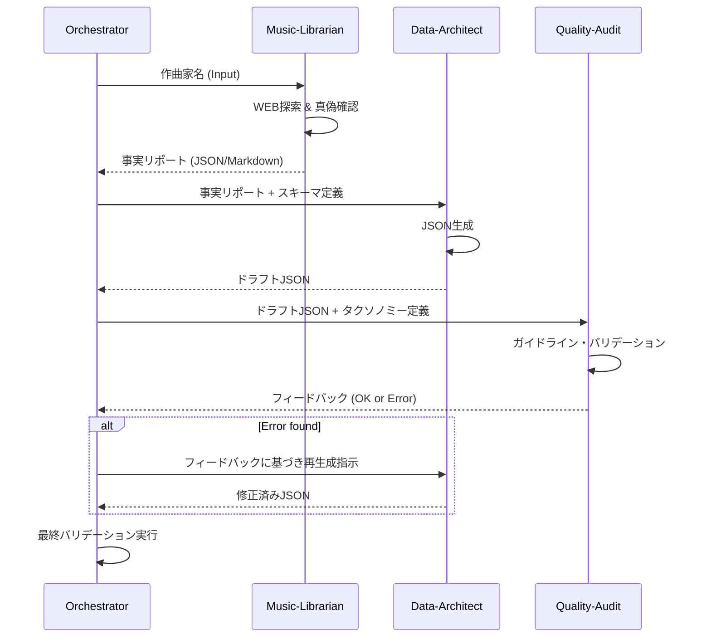

# Workflow: Composer Master Data Generation (Composer-GEN)

本ワークフローでは、特定の作曲家のマスターデータを、役割の異なる複数のエージェントが協調して生成します。

## 1. Collaborative Agents

| Role           | Agent Name        | Responsibility                                                              |
| :------------- | :---------------- | :-------------------------------------------------------------------------- |
| **Researcher** | `Music-Librarian` | Wikipedia, Wikimedia Commons, IMSLP 等から事実情報を収集。                  |
| **Writer**     | `Data-Architect`  | 収集された情報に基づき、プロジェクトの Zod スキーマに準拠した JSON を作成。 |
| **Reviewer**   | `Quality-Audit`   | 既存のタクソノミーとの不整合、肖像画のライセンス、事実誤認をチェック。      |

## 2. Execution Process

## 3. Data Interface

### Input

- `composerName`: 作曲家名 (e.g., "Frédéric Chopin")

### Process Artifacts

- `research_report.json`: 生没年月日、国籍、代表ジャンル、肖像画候補URL、出典元。
- `draft_composer.json`: スキーマ準拠の下書きデータ。

### Output

- `data/composers/<slug>.json`: 最終的なマスターデータ。

## 4. Key Constraints

- **Taxonomy Enforcement**: `representativeInstruments`, `era` 等は必ずプロジェクト定義済みの値を使用すること。
- **Portrait License**: 肖像画はパブリックドメインであることを Researcher が保証すること。
- **i18n**: 7ヶ国語のフィールド（名前、伝記）が全て埋まっていること（Translation-GEN との連携）。
