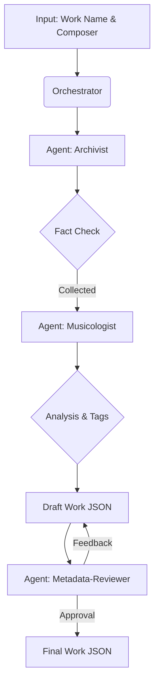

# Workflow: Work Master Data Generation (Work-GEN)

本ワークフローでは、特定の楽曲のマスターデータを、音楽的分析と事実調査を組み合わせて生成します。

## 1. Collaborative Agents

| Role           | Agent Name          | Responsibility                                                        |
| :------------- | :------------------ | :-------------------------------------------------------------------- |
| **Researcher** | `Archivist`         | カタログ番号、作曲年、初演、楽器編成、IMSLP リンク等の調査。          |
| **Analyzer**   | `Musicologist`      | 楽曲の構造（楽章）、印象評価（Impression Scales）、ムードタグの分析。 |
| **Reviewer**   | `Metadata-Reviewer` | タクソノミー準拠、カタログ番号の重複、分析の妥当性をチェック。        |

## 2. Execution Process

## 3. Specialized Instructions

### Analysis Criteria

- **Impression Scales**: 6軸（Bright, Emotional, Dramatic, etc.）のスコアを全楽章および全体に対して付与。
- **Genre & Form**: 各楽章に対し、`sonata-form`, `rondo` 等の形式タグをタクソノミーから厳選。
- **Time Signature**: 各楽章の拍子データを正確に抽出。

### Multi-Agent Coordination

- `Musicologist` は `Archivist` が特定した「楽章構成」を前提に分析を行う。
- `Metadata-Reviewer` は、特に「時代区分 (Era)」が作曲家の属性に引きずられていないか、その作品固有のスタイルを反映しているかを厳しくチェックする。

## 4. Data Interface

### Input

- `composerSlug`: 作曲家スラグ
- `workName`: 楽曲名

### Output

- `data/works/<composer-slug>/<slug>.json`
