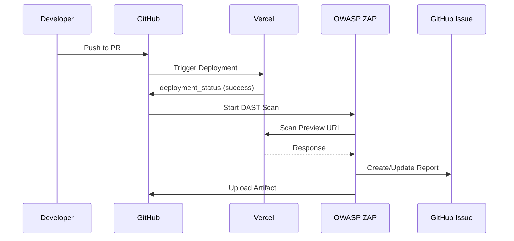

# セキュリティテスト設計書

## 概要

PreludioLabのセキュリティ品質を担保するため、SAST（静的解析）、SCA（依存関係スキャン）、DAST（動的診断）を組み合わせた多層防御戦略を採用します。

---

## DAST (Dynamic Application Security Testing)

### 目的

実際に稼働しているアプリケーション（Vercel Preview環境）に対して、外部からの攻撃をシミュレートし、OWASP Top 10などの脆弱性を早期に検知します。

### 実装方針

#### 使用ツール

- **OWASP ZAP (Zed Attack Proxy)**: オープンソースの動的セキュリティスキャナー
- **実行モード**: Baseline Scan（基本スキャン）
  - 侵入的なテストは行わず、受動的スキャンと軽量なアクティブスキャンのみ実施
  - 本番環境への影響を最小限に抑えつつ、一般的な脆弱性を検出

#### 実行環境

- **トリガー**: GitHub Actions (`deployment_status` イベント)
- **対象環境**: Vercel Preview Deployment
- **実行タイミング**: PRごとのプレビューデプロイ成功時
- **実行頻度**: 各PR更新時（自動）

### アーキテクチャ



### スキャン設定

#### 基本パラメータ

| パラメータ            | 値                                                 | 説明                       |
| :-------------------- | :------------------------------------------------- | :------------------------- |
| `target`              | `${{ github.event.deployment_status.target_url }}` | Vercel Preview URL         |
| `docker_name`         | `ghcr.io/zaproxy/zaproxy:stable`                   | ZAP安定版イメージ          |
| `rules_file_name`     | `.zap/zap-rules.conf`                              | 誤検知除外ルール           |
| `cmd_options`         | `-T 5`                                             | タイムアウト5分            |
| `fail_action`         | `false`                                            | 初期段階では警告のみ       |
| `allow_issue_writing` | `true`                                             | GitHub Issueへレポート投稿 |
| `issue_title`         | `DAST Scan Report - {SHA}`                         | Issue タイトル             |
| `artifact_name`       | `dast-scan-report`                                 | 成果物名                   |

#### スキャン範囲

**対象パス:**

- ✅ `/` - トップページ
- ✅ `/[lang]/*` - 多言語ルーティング
- ✅ `/[lang]/works/*` - 作品一覧・詳細
- ✅ `/[lang]/composers/*` - 作曲家一覧・詳細

**除外パス（将来的に設定）:**

- ❌ `/api/*` - APIエンドポイント（別途テスト）
- ❌ `/_next/*` - Next.js内部リソース
- ❌ `/admin/*` - 認証が必要な管理画面

#### スキャン制限

| 項目         | 設定値            | 理由                       |
| :----------- | :---------------- | :------------------------- |
| Spider時間   | 1分（デフォルト） | コスト最適化               |
| タイムアウト | 5分               | GitHub Actions実行時間制限 |
| クロール深度 | 制限なし          | 主要ページは浅い階層に配置 |

### 認証・アクセス制御

#### Vercel Deployment Protection

Vercel Preview環境には自動化保護がかかっているため、以下の方法でバイパスします。

**方法1: 環境変数による設定（推奨）**

```yaml
env:
  ZAP_AUTH_HEADER: 'x-vercel-protection-bypass'
  ZAP_AUTH_HEADER_VALUE: ${{ secrets.VERCEL_AUTOMATION_BYPASS_SECRET }}
```

**方法2: ZAP Replacer設定**

```yaml
cmd_options: >-
  -T 5
  -z "-config replacer.full_list(0).description=vercel-bypass
      -config replacer.full_list(0).enabled=true
      -config replacer.full_list(0).matchtype=REQ_HEADER
      -config replacer.full_list(0).matchstr=x-vercel-protection-bypass
      -config replacer.full_list(0).replacement=${{ secrets.VERCEL_AUTOMATION_BYPASS_SECRET }}"
```

#### 認証済みページのスキャン

**現状（Phase 1）:**

- 公開ページのみをスキャン対象
- Google OAuth認証が必要な管理画面は除外

**将来的な拡張（Phase 2）:**

1. **Context-based Authentication**
   - ZAPのContext機能でセッション管理
   - ログインフローを記録し、認証状態を維持
2. **Test User Account**
   - E2E専用のテストアカウントを作成
   - ZAPに認証情報を提供
3. **API Token Bypass**
   - 管理画面用の特別なBypassトークンを実装
   - `x-test-bypass-token` ヘッダーで認証をスキップ

### 誤検知（False Positive）管理

#### ルールファイル: `.zap/zap-rules.conf`

ZAPが報告するアラートのうち、プロジェクト特性上問題ないものを除外します。

**初期設定:**

```conf
# Cookie Without Secure Flag
# 理由: Preview環境ではHTTPSが保証されているが、Cookieに明示的なSecure属性がない場合がある
10011 IGNORE

# X-Content-Type-Options Header Missing
# 理由: Next.jsがデフォルトで適切なヘッダーを設定
10021 INFO

# CSP: Wildcard Directive
# 理由: 段階的にCSPを厳格化する予定。現時点では情報レベルで記録
10038 INFO

# Absence of Anti-CSRF Tokens
# 理由: Next.jsのServer Actionsは独自のCSRF対策を実装
10202 INFO
```

**ルールフォーマット:**

```
[Alert ID] [Action]
```

**アクション:**

- `IGNORE`: レポートに含めない（完全に無視）
- `INFO`: 情報レベルとして記録（ビルドは失敗させない）
- `WARN`: 警告レベル（デフォルト）
- `FAIL`: 失敗扱い（ビルドを失敗させる）

#### Alert ID 参照

主要なZAP Alert IDは以下のドキュメントで確認できます:

- [ZAP Alert IDs](https://www.zaproxy.org/docs/alerts/)

### レポーティング

#### GitHub Issue

スキャン結果は自動的にGitHub Issueとして投稿されます。

**Issue構成:**

- **タイトル**: `DAST Scan Report - {commit SHA}`
- **本文**:
  - スキャン対象URL
  - 検出された脆弱性の一覧（重要度別）
  - 各脆弱性の詳細（説明、影響、推奨対策）
- **ラベル**: `security`, `dast`
- **更新**: 同じPRへの再スキャン時は既存Issueを更新

#### Artifact

詳細なスキャンレポートはGitHub Actionsの成果物として保存されます。

**成果物:**

- **名前**: `dast-scan-report`
- **形式**: HTML, JSON, Markdown
- **保持期間**: 30日

### セキュリティ考慮事項

#### Secrets管理

| Secret名                          | 用途                    | 保存場所       |
| :-------------------------------- | :---------------------- | :------------- |
| `VERCEL_AUTOMATION_BYPASS_SECRET` | Preview環境へのアクセス | GitHub Secrets |
| `GITHUB_TOKEN`                    | Issue作成・更新         | 自動提供       |

#### スキャン対象の制限

**理由:**

- 過度なスキャンによるVercelの帯域消費を防ぐ
- GitHub Actionsの実行時間制限（6時間）内に完了させる
- 本番環境への影響を最小限に抑える

**対策:**

- Spider時間を1分に制限
- 全体タイムアウトを5分に設定
- 認証が必要なページは除外

### 運用フロー

#### 通常フロー

1. 開発者がPRを作成・更新
2. Vercelが自動的にPreview環境をデプロイ
3. デプロイ成功後、GitHub ActionsがDASTスキャンを開始
4. ZAPがPreview URLをスキャン
5. 結果をGitHub Issueとして投稿
6. 開発者が脆弱性を確認し、必要に応じて修正

#### 脆弱性検出時のフロー

1. **Critical/High**: 即座に修正、マージをブロック
2. **Medium**: 次のスプリントで修正を計画
3. **Low/Info**: バックログに追加、優先度に応じて対応

#### 誤検知の処理

1. 開発者が誤検知と判断
2. `.zap/zap-rules.conf` にルールを追加
3. PRを更新し、再スキャンで除外されることを確認
4. ルール追加の理由をコミットメッセージに記載

### パフォーマンス最適化

#### スキャン時間の短縮

- **並列実行**: 複数のPRが同時にスキャン可能
- **キャッシュ**: ZAP Dockerイメージをキャッシュ
- **スコープ制限**: 不要なパスを除外

#### コスト最適化

- **GitHub Actions**: 無料枠内で実行（月2,000分）
- **Vercel帯域**: Preview環境へのアクセスは帯域消費にカウントされない
- **ZAP**: オープンソースのため無料

### 今後の拡張計画

#### Phase 2: 認証済みページのスキャン

- 管理画面のセキュリティテスト
- ZAP Context機能の導入
- テストアカウントの作成

#### Phase 3: APIセキュリティテスト

- REST API エンドポイントの専用スキャン
- GraphQL スキーマのセキュリティ検証
- Rate Limiting のテスト

#### Phase 4: 本番環境の定期スキャン

- 週次での本番環境スキャン
- スケジュール実行（Cron）
- 結果をSlackに通知

### 参考資料

- [OWASP ZAP Documentation](https://www.zaproxy.org/docs/)
- [ZAP Baseline Scan](https://www.zaproxy.org/docs/docker/baseline-scan/)
- [GitHub Action: zaproxy/action-baseline](https://github.com/zaproxy/action-baseline)
- [OWASP Top 10](https://owasp.org/www-project-top-ten/)
