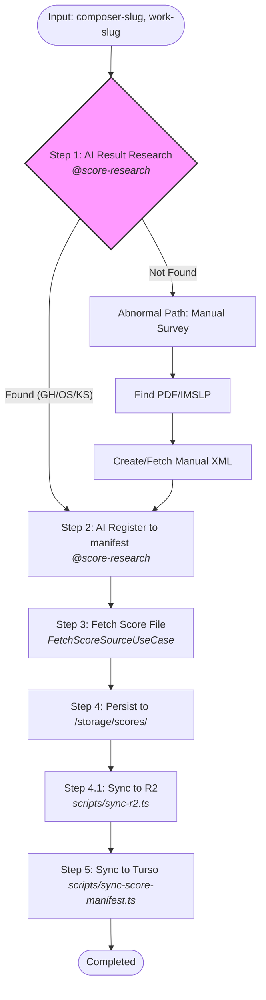

# 楽曲ソースの決定論的取得アーキテクチャ (Score Retrieval Architecture)

## 1. 背景と目的 (Background & Goals)

現在、本プロジェクトでは IMSLP や KernScores などの外部データソースから楽曲（MusicXML, Humdrum 等）を取得する仕組みを構築しています。従来の動的な CGI スクレイピングやディレクトリ探索には、以下の致命的な脆弱性がありました。

- **非決定性**: 外部サイトの構造変更やデータ削除により、URL が動的に変わりリンク切れが発生する。
- **パフォーマンス負荷**: 実行時に外部サイトへ都度アクセスして探索するため、処理が重く不安定。
- **単一障害点 (SPOF)**: 特定のプロバイダ一箇所にデータがない場合、システム全体がブロックされる。

これらの課題を解決し、**「Zero-Cost Architecture」**（実行時の動的探索コストをゼロにし、不変のデータソースのみを参照する）を実現するため、新しいアーキテクチャへ移行します。

### アーキテクチャの基本構成

- **SSoT (Single Source of Truth)**: `data/scores/manifest.yaml` (GitHub管理)
- **リポジトリ・カタログ**: `data/scores/repositories.yaml` (既知のリポジトリ)
- **カタログ (Catalog/Index)**: Turso Database (`score_sources` テーブル)
- **永続化レイヤー (Persistence)**:
  - **Cloudflare R2**: グローバルな不変ストレージ。`provider: r2` として利用可能。
  - **Local FS (`/storage/scores/`)**: ローカル開発・一時保管・大容量キャッシュ用の領域。
- **対象リポジトリ優先順位**:
  1. **GitHub (Specific Repos)**: craigsapp, humdrum-tools, openscore 等のメンテナンスされているGitソース。
  2. **OpenScore**: 高品質な MusicXML (.mxl) ソースを優先。
  3. **KernScores (Website/CGI)**: Gitソースが見つからない場合の最終手段。

---

## 2. 検討プロセスと学び (Process & Learnings)

本システムの設計過程で得られた重要な知見を、ADR（Architecture Decision Record）の形式で残します。

### 経緯 1: メタ・リポジトリ方式の試行

初期案として、KernScores 全体を管理する `humdrum-tools/humdrum-data` を Git Submodule として取り込む案を検討しました。

- **学び**: このリポジトリはインデックスとしての役割は優秀ですが、**「最新の LIST.txt に掲載されていない楽曲（例: 協奏曲 K. 466）」**の所在を特定することが極めて困難であることが分かりました。また、リポジトリ自体の容量が巨大化するリスクもありました。

### 経緯 2: K. 466 探索から得られた「単一ソースの限界」

当初のターゲットであった Mozart K. 466 は、パブリックな Humdrum エコシステムに存在しない（あるいは所在不明）ことが判明しました。

- **重要教訓**: 特定のデータ形式（Humdrum）や特定のプロバイダ（KernScores）に依存したアーキテクチャでは、10,000曲規模の網羅性は達成できない。「マルチソース化」が必須要件となりました。

### 経緯 3: ストラテジーの転換（Manifest-Driven への移行）

有識者からのアドバイスを受け、「自動探索」から**「正解台帳（マニフェスト）先行型」**へと方針を転換しました。

- **決定**: 「どこに何があるか」を人間（または AI）が事前に調査し、不変の URL を YAML に記述。これを DB へ流し込むパイプラインを先行して構築することで、開発の不確実性を排除します。

### 経緯 4: 「分析品質」と「表示品質」の乖離と手動調達の必然性 (K. 466 取得後の学び)

モーツァルトのピアノ協奏曲第20番（K. 466）の実データ取得を経て、以下の重要な知見を得ました。

- **学び 1: フォーマットの用途分離**: Humdrum (.krn) 形式は分析には優れているが、オーケストラ譜や複雑なピアノ譜の「視覚的な美しさ（2段大譜表のレイアウト等）」が欠落しているケースがある。表示用には MuseScore 由来の MusicXML (.mxl) が圧倒的に優れている。
- **学び 2: AIと人間の役割分担**: MuseScore.com のように「AIによる自動取得は困難だが、人間なら容易に高品質なデータを見つけられる」ソースが存在する。
- **決定**: AIに全自動を強いるのではなく、**「人間が目利きした高品質ソースを、AIが不変の資産としてシステムに定着させる（Manual Onboarding）」**プロセスを正式なワークフローとして定義する。

---

## 3. 設計指針 (Design Principles)

### 3.1 決定論的取得と不変性 (Immutability)

取得 URL には、リポジトリの特定のブランチ名（`main` 等）ではなく、**40文字のフルコミットハッシュ**を必須とします。これにより、外部リポジトリの更新やブランチ削除によるリンク切れ（Broken Link）を永久に防止します。

- `https://raw.githubusercontent.com/{owner}/{repo}/{hash}/{path}`

**運用ポリシー (Scan & Lock)**: 定期的なスキャン（Scan & Lock）により、最新の安定したコミットハッシュへ一括更新し、マニフェストを「ロック」するメンテナンスフローを想定します。

### 3.2 マルチソース・マルチフォーマット・マルチパーパス対応

単一のリポジトリ構造に依存せず、用途に応じた使い分けをマニフェストで許容します。

- **用途 (Purpose)**: 楽曲分析用 (Analysis) と 楽譜表示用 (Display) のソースを個別に登録可能とする。
- **形式 (Format)**: `.krn`, `.xml`, `.mxl`, `.mei`
- **プロバイダ (Provider)**: `github`, `musedata`, `r2` (手動調達バックアップ用)

### 3.3 SSOT (Single Source of Truth) の流向

1.  **data/scores/manifest.yaml** (正解データ正本、Git 管理)
2.  **data/scores/repositories.yaml** (リポジトリ・マニフェスト。AI が新発見時に追記)
3.  **scripts/sync-score-manifest.ts** (バリデーション & DB 同期)
4.  **Turso Database** (検索・表示用メタデータ)
5.  **scripts/sync-r2.ts** (ローカル成果物の R2 同期)
6.  **Application (Fetcher)** (DB の情報を元に R2 または GitHub から直接 Fetch)

---

## 4. 楽曲取得ワークフロー (Score Retrieval Workflow)

楽曲データの調査から取得、永続化までの標準的な流れを定義します。

### 4.1 標準フロー (Happy Path)



| ステップ名                       | 説明                                                                                      | Input                           | Output                                                          | ツール                                                      |
| :------------------------------- | :---------------------------------------------------------------------------------------- | :------------------------------ | :-------------------------------------------------------------- | :---------------------------------------------------------- |
| Step 1: リポジトリ検索           | 楽曲 slug に基づき、最適なソースを特定。既知のリポジトリ (`repositories.yaml`) も参照。   | `composer-slug`<br/>`work-slug` | リポジトリURL<br/>コミットハッシュ<br/>ファイルパス             | **@score-research** (AI Agent)                              |
| Step 2: マスターデータ生成       | 調査結果をマニフェストファイルへ登録。新規リポジトリの場合は `repositories.yaml` も更新。 | Step 1 の結果                   | `data/scores/manifest.yaml`<br/>`data/scores/repositories.yaml` | **@score-research** (AI Agent)                              |
| **Step 3: 楽曲データ取得**       | 指定された URL からバイナリデータをダウンロード。                                         | `manifest.yaml` (接続情報)      | 楽曲バイナリ (.mxl, .krn)                                       | `FetchScoreSourceUseCase`<br/>`scripts/test-fetch-score.ts` |
| **Step 4: 永続化 (Persistence)** | 取得データをローカルおよびクラウドへ保存。                                                | 楽曲バイナリ                    | `/storage/scores/` 保存<br/>Cloudflare R2 格納済データ          | `scripts/sync-r2.ts`                                        |
| **Step 5: Turso への同期**       | マニフェスト内容を DB に反映。同時に有効性を最終確認。                                    | `data/scores/manifest.yaml`     | Turso `score_sources` テーブルのレコード                        | `scripts/sync-score-manifest.ts`                            |

### 4.2 異常系・手動調達フロー (Abnormal / Manual Path)

デジタルスコア（MusicXML/Humdrum）がパブリックリポジトリに存在しない、あるいは表示品質が著しく低い場合：

1.  **人間による調達**: MuseScore.com 等から高品質な `.mxl` を手動でダウンロード。
2.  **ローカル配置**: `/storage/scores/{composer}/{work}/manual-curated.mxl` に配置。
3.  **マニフェスト登録**: AI が `provider: r2`（または `local`）として登録し、ファイルハッシュを記録。
4.  **永続化**: `scripts/sync-r2.ts` により不変ストレージへ同期。

---

## 5. 実装要件 (Implementation Requirements)

### 5.1 マニフェスト形式 (`data/scores/manifest.yaml`)

```yaml
- work_slug: piano-sonata-no-11-k331
  provider: github
  repository_owner: craigsapp
  repository_name: mozart-piano-sonatas
  commit_hash: 'a1b2c3d4e5f6g7h8i9j0...'
  path: 'kern/sonata11-1.krn'
  format: krn
  license: 'CC-BY-SA 4.0'
```

### 5.2 リポジトリ・形式 (`data/scores/repositories.yaml`)

```yaml
- id: 'craigsapp/mozart-piano-sonatas'
  provider: github
  owner: craigsapp
  name: mozart-piano-sonatas
  description: 'Mozart Piano Sonatas (Kern format). Contains all 18 sonatas.'
  license: 'CC0 1.0'
```

### 5.3 DB 構成 (`score_sources` テーブル)

物理設計の詳細は [データベーススキーマ設計 (schema.md)](../02_database/schema.md#44-score_sources-deterministic-retrieval-source) を参照してください。

本アーキテクチャでは、`score_sources` テーブルは **SSoT (manifest.yaml)** の情報をアプリケーションから高速に参照するためのカタログとして機能します。

- **不変性の担保**: `commit_hash` カラムには必ず 40 文字の完全なハッシュを格納します。
- **マルチソース解決**: `work_id` と `work_part_slug`、および `provider` の複合キーにより、特定の楽曲パーツに対して複数のソース（GitHub, R2等）を並行して管理可能です。

### 5.3 同期スクリプト

#### `scripts/sync-score-manifest.ts`

- YAML の内容を Turso へ Upsert する。
- **ID解決**: `work_slug` に基づいて `works` テーブルから UUID (`work_id`) を解決して紐付けを行う。
- 実行時に生成した URL に対して HEAD リクエストを送り、実在を確認するバリデーション機能を備える。
- **形式検証**: Content-Type をチェックし、圧縮バイナリ (.mxl) の場合は取得後に解凍処理 (Unzip) が必要であることを考慮した設計とする。

#### `scripts/sync-r2.ts`

- ローカルの `/storage/scores/`（または `public/`）配下のファイルを Cloudflare R2 へ同期する。
- 取得した実ファイルを R2 に永続化することで、外部リポジトリのダウンタイムや削除に備えるバックアップとしても機能する。

---

## 6. スコープ定義 (Scope)

### 6.1 スコープ内 (In Scope)

- 楽曲データファイル (.mxl, .krn) の特定と取得
- R2 / Local FS への永続化
- メタデータの DB 同期と不変 URL 生成

### 6.2 スコープ外 (Out of Scope)

- **フレーズ抽出**: 楽曲データの解析と部分抽出は、別のワークフロー（フレーズ解析プロセス）で扱う。
- **自動演奏生成**: 取得したデータに基づく音源生成はスコープ外。

---

## 7. ロードマップ (Roadmap)

1. **Phase 1 (Sync)**: マニフェスト形式を確定し、K. 331 / K. 545 を対象とした DB 同期を完遂。
2. **Phase 2 (Fetch)**: マルチフォーマット対応の GitHub Fetcher 実装。
3. **Phase 3 (Expand)**: OpenScore 等の MusicXML データソースを追加し、K. 466 を含む欠落楽曲を補完。
