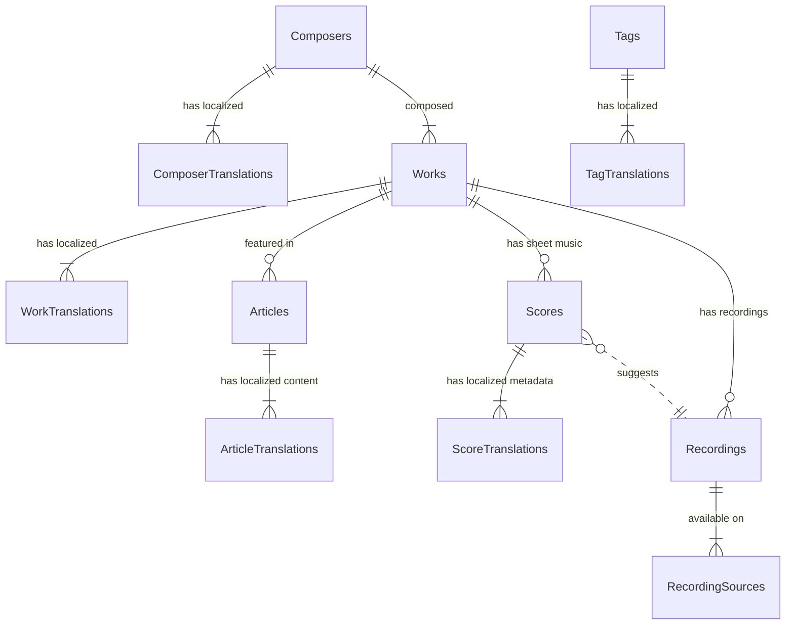

# データベーススキーマ設計 (Database Schema Design)

本ドキュメントでは、PreludioLabのデータ永続化層（PostgreSQL on Supabase）の物理設計を定義します。
[Search Requirements](../01_specs/search-requirements.md) で定義された「Read-Optimized (Zero-JOIN)」戦略に基づき、検索パフォーマンスと開発者体験を最優先した設計となっています。

## 1. Design Policy (設計方針)

### 1.1 Read-Optimized / Zero-JOIN
検索・一覧表示のパフォーマンスを最大化するため、頻繁にアクセスされる属性（作曲家名、曲名、ジャンル等）を `Articles` テーブル群に**非正規化（Denormalization）**して保持します。
これにより、ユーザーアクセス時の複雑な JOIN を排除します。

### 1.2 Enterprise Standards
*   **Audit Trails:** 全テーブルに `created_at` (Immutable), `updated_at` (Triggerにより自動更新) を持たせます。
*   **Surrogate Keys:** 主キーには **UUID v7** (時間ソート可能) を採用します。外部システム（Storage path等）との親和性を高めます。
*   **Naming Convention:**
    *   Table/Column: `snake_case` (Postgres Standard)
    *   API Response: `CamelCase` (Application Layerで変換)

### 1.3 Security (RLS)
**"Secure by Default"** を徹底します。
すべてのテーブルで RLS (Row Level Security) を有効化し、明示的なポリシーがない限りアクセスを拒否します。

### 1.4 Database Extensions
全文検索 (`pg_trgm`) およびベクトル検索 (`vector`) を有効化します。
※ 容量管理のため、`vector` の使用は `article_translations` テーブルに限定します。

```sql
create extension if not exists pg_trgm;
create extension if not exists vector;
```

---

## 2. ER Diagram (Entity Relationship)



---

## 3. Core Tables: Articles (Application Data)

記事管理の中核テーブル。検索要件に基づき、多くの属性を非正規化して持ちます。

### 3.1 `articles` (Universal)
言語に依存しない、記事の存在そのものを管理する親テーブル。

| Column | Type | Default | Nullable | Description |
| :--- | :--- | :--- | :--- | :--- |
| **`id`** | `uuid` | `uuid_generate_v7()` | NO | **PK**. UUID v7 (Time-sortable) |
| `work_id` | `uuid` | - | YES | FK to `works.id`. 記事に関連する主作品（あれば） |
| `slug` | `text` | - | NO | **Universal Slug**. 英語ベースの識別子。例: `symphony-no5` (Routing層で `beethoven/symphony-no5` のように組み立てる想定) |
| `is_featured` | `boolean` | `false` | NO | おすすめ/キュレーション対象フラグ |
| `created_at` | `timestamptz` | `now()` | NO | 作成日時 |
| `updated_at` | `timestamptz` | `now()` | NO | 更新日時 (Trigger) |

### 3.2 `article_translations` (Localized / Read-Optimized)
言語ごとの記事データ。**検索用カラム（非正規化データ）をここに集約します。**

| Column | Type | Default | Nullable | Description |
| :--- | :--- | :--- | :--- | :--- |
| **`id`** | `uuid` | `uuid_generate_v7()` | NO | **PK**. |
| `article_id` | `uuid` | - | NO | FK to `articles.id` |
| `lang` | `text` | - | NO | ISO Language Code ('ja', 'en'...) |
| **`status`** | `text` | `'draft'` | NO | 'draft', 'published', 'private', 'archived' |
| `title` | `text` | - | NO | 記事のH1タイトル |
| **`display_title`** | `text` | - | NO | **[Denormalized]** 一覧表示用タイトル |
| **`sl_composer_name`** | `text` | - | YES | **[Denormalized]** 作曲家名 (Search Key) |
| **`sl_catalogue_id`** | `text` | - | YES | **[Denormalized]** 作品番号 (Search Key) |
| **`sl_nicknames`** | `text[]` | - | YES | **[Denormalized]** 通称リスト (JSONB/Array) for SEO |
| **`sl_genre`** | `text` | - | YES | **[Denormalized]** ジャンル/カテゴリ |
| **`sl_instrumentation`**| `text`| - | YES | **[Denormalized]** 楽器編成 |
| **`sl_era`** | `text` | - | YES | **[Denormalized]** 時代区分 |
| **`sl_nationality`** | `text` | - | YES | **[Denormalized]** 地域/国籍 |
| **`sl_mood_dimensions`**| `jsonb`| - | YES | **[Hybrid Search]** 5軸の感情定量値 (-1.0 ~ +1.0) |
| **`embedding`** | `halfvec(768)` | - | YES | **[Hybrid Search]** Embedding Vector (16-bit, 768 dimensions) |
| `published_at` | `timestamptz` | - | YES | 公開日時 |
| `mdx_uri` | `text` | - | YES | ストレージ上のMDXパス (`article/{uuid}.mdx`) |
| `thumbnail_url` | `text` | - | YES | **[Snapshot]** 一覧表示用サムネイル画像URL |
| `metadata` | `jsonb` | `{}` | NO | その他メタデータ (Tags, Key, Difficulty) |
| `content_structure` | `jsonb` | `{}` | NO | **[ToC/Search]** 目次構成データ。MDX本体をパースせずに目次生成やセクション検索を行うために使用。 |
| `created_at` | `timestamptz` | `now()` | NO | - |
| `updated_at` | `timestamptz` | `now()` | NO | - |

> **Naming Note:** 非正規化カラムには `sl_` (Snapshot / Search Layer) プレフィックスを付ける案もありましたが、開発者の利便性を考え、通常のカラム名 (`composer_name` 等) とし、API層で管理します。ここでは分かりやすく `sl_` と記述していますが、実際の実装では `composer_name` とします。

**Indexes:**
*   `article_translations(lang, status)`: 基本フィルタリング
*   `article_translations(lang, sl_genre)`: ジャンル検索
*   `article_translations` GIN (`metadata`): タグ検索 (`metadata -> 'tags'`)

#### JSONB Type Definitions
これらのカラムに格納される TypeScript 型定義。

##### `content_structure` (Visual Outline)
記事の目次やプレビュー表示に使用される軽量な構造データ。
```typescript
type ContentStructure = Section[];

type Section = 
  | { id: string; type: 'text'; heading: string; level: 2 | 3 } // 目次用
  | { id: string; type: 'score'; work_id: string; caption?: string } // 譜例プレビュー用
  | { id: string; type: 'youtube'; videoId: string; start: number } // 動画プレビュー用
```

##### `sl_mood_dimensions` (Quantitative Mood)
AIによってスコアリングされた5つの感情軸。
```typescript
type MoodDimensions = {
  brightness: number;  // Dark (-1) <-> Bright (+1)
  vibrancy: number;    // Calm (-1) <-> Energetic (+1)
  scale: number;       // Intimate (-1) <-> Grand (+1)
  depth: number;       // Light (-1) <-> Deep (+1)
  drama: number;       // Pure (-1) <-> Cinematic (+1)
};
```

##### `metadata` (Search Attributes)
```typescript
type ArticleMetadata = {
  tags: string[];         // e.g. ["Sad", "Morning", "Baroque"]
  key?: string;           // e.g. "C Major"
  difficulty?: 1 | 2 | 3 | 4 | 5;
  ogp_url?: string;       // Generated OGP Image URL
};
```

---

## 4. Asset Tables: Scores

楽譜ビュワーで使用するデータ。

### 4.1 `scores` (Universal Asset)
| Column | Type | Default | Nullable | Description |
| :--- | :--- | :--- | :--- | :--- |
| **`id`** | `uuid` | `uuid_generate_v7()` | NO | **PK** |
| `work_id` | `uuid` | - | NO | FK to `works.id` |
| `format` | `text` | - | NO | 'abc', 'musicxml' |
| `data` | `text` | - | NO | 楽譜データ実体 (Text format) |
| **`playback_samples`**| `jsonb`| `[]` | NO | **[Playback Bindings]** 録音との紐付けと再生区間情報の配列 |
| `created_at` | `timestamptz` | `now()` | NO | - |
| `updated_at` | `timestamptz` | `now()` | NO | - |

#### JSONB Type Definitions

##### `playback_samples` (Playback Binding)
1つの楽譜切片に対応する1つ以上の録音ソースと再生位置の定義。

```typescript
type PlaybackSample = {
  recording_id: string;  // FK to recordings.id
  start_time: number;    // 再生開始時間（秒）
  end_time: number;      // 再生終了時間（秒）
  is_default: boolean;   // デフォルト再生用フラグ
  label?: string;        // UI表示用 (e.g. "Gould (1981)")
  offset_ms?: number;    // ソースごとの微調整用
};

type PlaybackSamples = PlaybackSample[];
```

### 4.2 `score_translations` (Localized Metadata)
楽譜のキャプションや説明文。
| Column | Type | Default | Nullable | Description |
| :--- | :--- | :--- | :--- | :--- |
| **`id`** | `uuid` | `uuid_generate_v7()` | NO | **PK** |
| `score_id` | `uuid` | - | NO | FK to `scores.id` |
| `lang` | `text` | - | NO | 'ja', 'en'... |
| `caption` | `text` | - | NO | 譜例のタイトル (e.g. "第1主題") |
| `description` | `text` | - | YES | 補足説明 |

---

## 5. Master Tables: Composers & Works

正規化された参照用データ（信頼できる情報源）。記事作成時の入力補助や、Batch処理によるデータ整合性チェックに使用します。
**Zero-JOIN戦略のため、ユーザーアクセス時にこのテーブルがJOINされることは基本ありません。**

### 5.1 `composers` / `composer_translations`
**`composers`**
| Column | Type | Default | Nullable | Description |
| :--- | :--- | :--- | :--- | :--- |
| **`id`** | `uuid` | `uuid_generate_v7()` | NO | **PK** |
| `slug` | `text` | - | NO | e.g. `bach` |
| `born_at` | `date` | - | YES | 生年月日 |
| `died_at` | `date` | - | YES | 没年月日 |
| `nationality_code` | `text` | - | YES | ISO Country Code |

**`composer_translations`**
| Column | Type | Default | Nullable | Description |
| :--- | :--- | :--- | :--- | :--- |
| **`id`** | `uuid` | `uuid_generate_v7()` | NO | **PK** |
| `composer_id` | `uuid` | - | NO | FK |
| `lang` | `text` | - | NO | `en`, `ja` |
| `name` | `text` | - | NO | Localized Name (e.g. "バッハ") |
| `bio` | `text` | - | YES | 人物伝記。作曲家の生涯、作風、歴史的意義などを記述。作曲家詳細ページのメインコンテンツ。 |

### 5.2 `works` / `work_translations`
**`works`**
| Column | Type | Default | Nullable | Description |
| :--- | :--- | :--- | :--- | :--- |
| **`id`** | `uuid` | `uuid_generate_v7()` | NO | **PK** |
| `composer_id` | `uuid` | - | NO | FK |
| `slug` | `text` | - | NO | e.g. `symphony-no5`. URLの構成要素。 |
| `catalogue_prefix` | `text` | - | YES | `Op.`, `BWV`, `D`, `K` 等のカタログ番号接頭辞 |
| `catalogue_number` | `text` | - | YES | `67`, `1001` 等のカタログ番号 |
| `key_tonality` | `text` | - | YES | `C Major`, `D Minor` |

**`work_translations`**
| Column | Type | Default | Nullable | Description |
| :--- | :--- | :--- | :--- | :--- |
| **`id`** | `uuid` | `uuid_generate_v7()` | NO | **PK** |
| `work_id` | `uuid` | - | NO | FK |
| `lang` | `text` | - | NO | `en`, `ja` |
| `title` | `text` | - | NO | 正式名称 (e.g. "Symphony No. 5") |
| `popular_title` | `text` | - | YES | **[Primary UI]** 一般的な通称。一覧やタイトルで使用 (e.g. "運命") |
| `nicknames` | `text[]` | - | YES | **[Search Aliases]** 検索でヒットさせるための別名・揺らぎ (e.g. ["Schicksal", "Fate"]) |

### 5.3 `tags` (Normalized Taxonomy)
ComposerやWork、Instrumentといった**「構造化された属性」に当てはまらない、横断的な検索軸（Cross-cutting Dimensions）**を管理します。
[Search Requirements](../01_specs/search-requirements.md) の Cluster 3 (Mood/Situation) および Cluster 4 の一部をカバーします。

**`tags`**
| Column | Type | Default | Nullable | Description |
| :--- | :--- | :--- | :--- | :--- |
| **`id`** | `uuid` | `uuid_generate_v7()` | NO | **PK** |
| `category` | `text` | - | NO | `mood`, `situation`, `terminology` |
| `slug` | `text` | - | NO | `deep-focus`, `sonata-form` |

**`tag_translations`**
| Column | Type | Default | Nullable | Description |
| :--- | :--- | :--- | :--- | :--- |
| **`id`** | `uuid` | `uuid_generate_v7()` | NO | **PK** |
| `tag_id` | `uuid` | - | NO | FK |
| `lang` | `text` | - | NO | `en`, `ja` |
| `name` | `text` | - | NO | Display Name (e.g. "深い集中") |

### 5.4 `media_assets` (Generic Assets)
サイト内で使用する汎用的な静的ファイル（画像、PDF等）。
| Column | Type | Default | Nullable | Description |
| :--- | :--- | :--- | :--- | :--- |
| **`id`** | `uuid` | `uuid_generate_v7()` | NO | **PK** |
| `media_type` | `text` | - | NO | `'image'`, `'document'` |
| `url` | `text` | - | NO | Storage Public URL |
| `alt_text` | `jsonb` | `{}` | YES | **[i18n]** Localized Alt Text `{ "ja": "...", "en": "..." }` |
| `metadata` | `jsonb` | `{}` | NO | width, height, file_size |

### 5.5 `recordings` (Domain Entity)
「誰の、いつの演奏か」という音楽的なメタデータを管理する実体。
| Column | Type | Default | Nullable | Description |
| :--- | :--- | :--- | :--- | :--- |
| **`id`** | `uuid` | `uuid_generate_v7()` | NO | **PK** |
| `work_id` | `uuid` | - | NO | FK to `works.id` |
| `performer_name` | `text` | - | NO | 演奏者名（表示用）。e.g. "Herbert von Karajan" |
| `recording_year` | `int` | - | YES | 録音年 |
| `is_recommended` | `boolean` | `false` | NO | おすすめフラグ |

*Note:* `performers` (jsonb) は `performer_name` と重複するため削除しました。構造化が必要になった場合はテーブル化を検討します。

### 5.6 `recording_sources` (Media Providers)
1つの録音（Recording）に紐づく、具体的な再生手段。
| Column | Type | Default | Nullable | Description |
| :--- | :--- | :--- | :--- | :--- |
| **`id`** | `uuid` | `uuid_generate_v7()` | NO | **PK** |
| `recording_id` | `uuid` | - | NO | FK to `recordings.id` |
| `provider` | `text` | - | NO | `'youtube'`, `'spotify'` |
| `source_id` | `text` | - | NO | External ID / URI (e.g. Video ID) |
| `quality` | `text` | - | YES | `'high'`, `'medium'` |

---

## 6. RLS Policies (Security)

### Public Access (Anonymous)
*   **Articles:** `status = 'published'` AND `published_at <= NOW()` のレコードのみ `SELECT` を許可。
*   **Masters (Composers/Works):** 全件 `SELECT` 許可（公共情報のため）。
*   **Scores:** 関連する `Articles` が閲覧可能な場合のみ許可（またはPublic許可）。

### Admin Access (Service Role)
*   全テーブルに対して `ALL` (SELECT, INSERT, UPDATE, DELETE) を許可。

---

## 7. Verification & Migration Strategy

本スキーマの実装と検証は、以下の戦略で進めます。

### 7.1 Migration Workflow
Suapbase CLI (Local Development) を使用します。
1.  **Draft:** `docs/05_design/database-schema.md` (本ドキュメント) を正本とします。
2.  **Generate:** `supabase migration new create_tables`
3.  **Implement:** SQLファイル手動作成、またはStudioで作成して `db diff`。
4.  **Apply:** `supabase db reset` (Local).

### 7.2 Verification
*   **Static Check:** `db pull` した型定義 (`src/types/supabase.ts`) と、ドメインエンティティの一致確認。
*   **Data Integrity:** サンプルデータを投入し、`zod` スキーマ (`mdx-article-specs.md`) を通過することを確認。
*   **Performance:** `EXPLAIN ANALYZE` を使用し、Zero-JOIN クエリ（基本属性検索）が Index Scan となることを確認。
