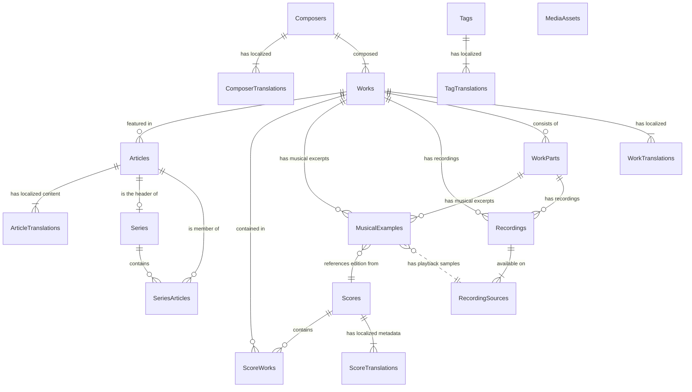
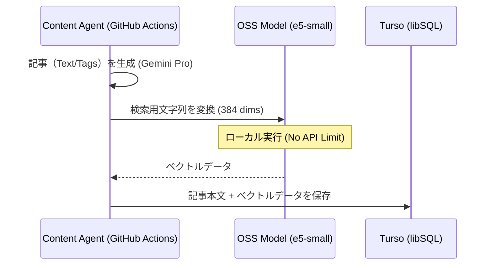
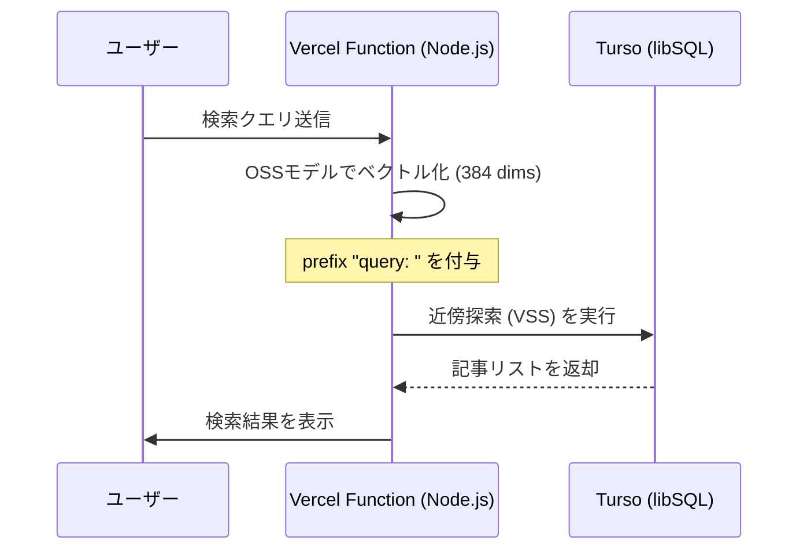

# データベーススキーマ設計 (Database Schema Design)

本ドキュメントでは、PreludioLabのデータ永続化層（libSQL on Turso）の物理設計を定義します。
[Search Requirements](../01_specs/search-requirements.md) で定義された「Read-Optimized (Zero-JOIN)」戦略に基づき、検索パフォーマンスと開発者体験を最優先した設計となっています。

## 1. Design Policy (設計方針)

### 1.1 Read-Optimized / Zero-JOIN

検索・一覧表示のパフォーマンスを最大化するため、頻繁にアクセスされる属性（作曲家名、曲名、ジャンル等）を `Articles` テーブル群に**非正規化（Denormalization）**して保持します。
これにより、ユーザーアクセス時の複雑な JOIN を排除します。

### 1.2 Enterprise Standards

- **Audit Trails:** 全テーブルに `created_at` (Immutable), `updated_at` を持たせます。
- **Surrogate Keys:** 主キーには **UUID v7** を採用し、`TEXT` 型として格納します。
- **Data Integrity (Physical):**
  - カラムごとに **`NOT NULL`** 制約の有無を定義します。
  - 特定の値のみを許可する場合は **`CHECK`** 制約を適用します。
  - **Foreign Keys:** Turso/SQLiteの外部キー制約機能 (`PRAGMA foreign_keys = ON`) を有効化し、物理レベルで参照整合性を担保します。
- **Naming Convention:**
  - Table/Column: `snake_case` (Standard)
  - API Response: `CamelCase` (Application Layerで変換)
- **Index Notation:** 物理設計表において、`UNIQUE` は一意制約を伴う B-Tree インデックス、`B-Tree` は非一意インデックスを指します。

### 1.3 Security (Access Control)

TursoにはネイティブのRLSがないため、アプリケーション層（Next.js Server Actions / API Routes）で認証情報（JWT）に基づいたアクセス制御を徹底します。
原則として、公開ステータス以外のデータへのアクセスはアプリケーション側で制御されたクエリによって制限されます。

### 1.4 Database Extensions

全文検索 (`FTS5`) およびベクトル検索 (`libsql-vector`) を活用します。

- **FTS5:** SQLite標準の全文検索エンジン。
- **libsql-vector:** Turso/libSQLによるネイティブベクトル検索。

### 1.5 Domain Model Mapping (Clean Architecture)

物理モデル（DB設計）をそのままドメイン層へ持ち込まず、以下の原則でマッピングします。

- **Single Entity Pattern:** 物理的には `translations` テーブルに分かれている情報も、ドメイン層では一つの統合されたエンティティ（例: `Work`）として定義します。
- **Encapsulation by Repository:** 永続化の詳細（テーブルの分割やJSONB構造）は Repository 層で隠蔽します。ドメイン層は「現在の言語でハイドレーションされた、使いやすいオブジェクト」のみを扱います。
- **Zero-JOIN Alignment:** 物理設計における「非正規化カラム（Snapshot）」は、このドメインエンティティを高速に生成するために最適化されています。
- **ID-Based Integrity with Slug-Based DX:**
  - 内部的な参照（FK）は「不変性」を担保するため常に **UUID (id)** を起点とします。
  - 開発者体験 (DX) やエージェントの操作、URL構築には **Slug** を使用します。
  - アプリケーション層（Repository/Service）が Slug から ID への解決（Resolution）を責務として持ち、物理層の堅牢性と論理層の利便性を両立します。

---

## 2. ER Diagram (Entity Relationship)



---

## 3. Core Tables: Articles & Series

記事管理の中核テーブル。検索要件に基づき、多くの属性を非正規化して持ちます。

### 3.1 `articles` (Universal)

言語に依存しない、記事の存在そのものを管理する親テーブル。

| Column                 | Type      | Default | NOT NULL | CHECK                                  | Description                                                 |
| :--------------------- | :-------- | :------ | :------- | :------------------------------------- | :---------------------------------------------------------- |
| **`id`**               | `text`    | -       | YES      | -                                      | **PK**. UUID v7                                             |
| **`work_id`**          | `text`    | -       | NO       | -                                      | **FK to `works.id`**                                        |
| `slug`                 | `text`    | -       | YES      | -                                      | **Universal Slug**                                          |
| `is_featured`          | `integer` | `0`     | YES      | `IN (0, 1)`                            | おすすめフラグ                                              |
| `created_at`           | `text`    | -       | YES      | **`datetime(created_at) IS NOT NULL`** | 作成日時 (ISO8601形式を強制)                                |
| `updated_at`           | `text`    | -       | YES      | **`datetime(updated_at) IS NOT NULL`** | 更新日時 (ISO8601形式を強制)                                |
| `reading_time_seconds` | `integer` | -       | NO       | `reading_time_seconds > 0`             | 読了目安時間（秒）                                          |
| `thumbnail_path`       | `text`    | -       | NO       | -                                      | **[Universal Asset]** サムネイル画像パス (文字なし共通画像) |

#### 3.1.1 Indexes (Articles)

| Index Name              | Columns                     | Type       | Usage                              |
| :---------------------- | :-------------------------- | :--------- | :--------------------------------- |
| `idx_articles_work_id`  | `(work_id)`                 | B-Tree     | 外部キーによる検索                 |
| `idx_articles_slug`     | `(slug)`                    | **UNIQUE** | ルーティング用（ユニーク）         |
| `idx_articles_featured` | `(is_featured, created_at)` | B-Tree     | トップページ等でのピックアップ表示 |

### 3.2 `article_translations` (Localized / Read-Optimized)

言語ごとの記事データ。検索用カラム（非正規化データ）をここに集約します。

| Column                      | Type      | Default | NOT NULL | CHECK                                                            | Description                                                            |
| :-------------------------- | :-------- | :------ | :------- | :--------------------------------------------------------------- | :--------------------------------------------------------------------- |
| **`id`**                    | `text`    | -       | YES      | -                                                                | **PK**.                                                                |
| **`article_id`**            | `text`    | -       | YES      | -                                                                | **FK to `articles.id`**                                                |
| `lang`                      | `text`    | -       | YES      | -                                                                | ISO Language Code                                                      |
| `status`                    | `text`    | -       | YES      | `IN ('draft', 'scheduled', 'published', 'private', 'archived')`  | ステータス                                                             |
| `title`                     | `text`    | -       | YES      | -                                                                | 記事タイトル（正式名称）                                               |
| `display_title`             | `text`    | -       | YES      | -                                                                | **[Denormalized]** 一覧表示用タイトル (SEO/UX最適化済み)               |
| `catchcopy`                 | `text`    | -       | NO       | -                                                                | **[Micro-copy]** サムネイル重畳用の短文 (未入力時は非表示)             |
| `excerpt`                   | `text`    | -       | NO       | -                                                                | **[SEO/OGP]** 記事の抜粋・概要 (120文字程度)                           |
| `sl_composer_name`          | `text`    | -       | NO       | -                                                                | 作曲家名 (Source: `composer_translations.name`)                        |
| `sl_work_catalogue_id`      | `text`    | -       | NO       | -                                                                | 作品番号 (Source: `works.catalogue_prefix/number`, e.g. "BWV 846")     |
| `sl_work_nicknames`         | `text`    | -       | NO       | -                                                                | 通称リスト (JSON, Source: `work_translations.nicknames`)               |
| `sl_genre`                  | `text`    | -       | NO       | -                                                                | ジャンルリスト (JSON, Source: `works.genres`)                          |
| `sl_instrumentations`       | `text`    | -       | NO       | -                                                                | 楽器編成リスト (JSON, Source: `tags.slug` where category='instrument') |
| `sl_era`                    | `text`    | -       | NO       | -                                                                | 時代区分 (Source: `works.era`)                                         |
| `sl_nationality`            | `text`    | -       | NO       | -                                                                | 地域/国籍 (Source: `composers.nationality_code`)                       |
| `sl_key`                    | `text`    | -       | NO       | -                                                                | **[Snapshot]** 調性 (Source: `works.key_tonality`)                     |
| `sl_performance_difficulty` | `integer` | -       | NO       | -                                                                | **[Snapshot]** 演奏難易度 (Source: `works.performance_difficulty`)     |
| `sl_impression_dimensions`  | `text`    | -       | NO       | -                                                                | **[Snapshot]** 6軸定量値 (JSON: `ImpressionDimensions`)                |
| `content_embedding`         | `F32BLOB` | -       | NO       | -                                                                | ベクトルデータ (384 dims, Model: `e5-small`)                           |
| `published_at`              | `text`    | -       | NO       | **`published_at IS NULL OR datetime(published_at) IS NOT NULL`** | 公開日時 (形式強制)                                                    |
| `is_featured`               | `integer` | `0`     | YES      | `IN (0, 1)`                                                      | **[Snapshot]** おすすめフラグ                                          |
| `mdx_path`                  | `text`    | -       | NO       | -                                                                | MDX相対パス (e.g. `works/bwv846.mdx`)                                  |
| `sl_series_assignments`     | `text`    | `[]`    | YES      | -                                                                | 所属シリーズ情報 (JSON: `SeriesAssignment[]`)                          |
| `metadata`                  | `text`    | `{}`    | YES      | -                                                                | メタデータ (JSON: `ArticleMetadata`)                                   |
| `content_structure`         | `text`    | `{}`    | YES      | -                                                                | 目次構成 (JSON: `ContentStructure`)                                    |
| `created_at`                | `text`    | -       | YES      | **`datetime(created_at) IS NOT NULL`**                           | 作成日時 (形式強制)                                                    |
| `updated_at`                | `text`    | -       | YES      | **`datetime(updated_at) IS NOT NULL`**                           | 更新日時 (形式強制)                                                    |

#### 3.2.1 JSON Type Definitions

これらのカラムに格納される TypeScript 型定義。

##### 3.2.1.1 `content_structure` (Visual Outline / TOC)

記事の目次（Table of Contents）に使用される構造データ。

```typescript
type ContentStructure = Section[];

type Section =
  | { id: string; type: 'heading'; text: string; level: 2 | 3 } // 目次（H2/H3）
  | { id: string; type: 'recording'; label?: string }; // [Optional] 記事内の主要な録音セクション
```

##### 3.2.1.2 `sl_impression_dimensions` (Quantitative Impression)

AIによってスコアリングされた6つの評価軸。詳細は [Search Requirements](../01_specs/search-requirements.md) を参照。**各値は -10 から +10 の整数（1刻み、0=中立/Neutral）**です。

```typescript
type ImpressionDimensions = {
  brightness: number; // Dark (-10) <-> Bright (+10)
  vibrancy: number; // Calm (-10) <-> Energetic (+10)
  scale: number; // Intimate (-10) <-> Grand (+10)
  depth: number; // Light (-10) <-> Deep (+10)
  drama: number; // Pure (-10) <-> Cinematic (+10)
  popularity: number; // Niche (-10) <-> Famous (+10)
};
```

```typescript
type ArticleMetadata = {
  tags: string[]; // e.g. ["Sad", "Morning", "Baroque"]
  key?: string; // e.g. "C Major"
  difficulty?: 1 | 2 | 3 | 4 | 5; // 1:Beginner, 2:Elementary, 3:Intermediate, 4:Advanced, 5:Virtuoso
  ogp_url?: string; // Generated OGP Image URL
  ui_accent_color?: string; // HEX color for article theme (e.g. dominant color)
  reading_style?: 'brief' | 'standard' | 'deep_dive'; // Intent for reading depth
  target_audience?: 'listener' | 'performer' | 'both'; // Target user segment
};
```

##### 3.2.1.4 `instrumentation_flags` (Instrumentation Filtering)

```typescript
type InstrumentationFlags = {
  isSolo: boolean;
  isChamber: boolean;
  isOrchestral: boolean;
  hasChorus: boolean;
  hasVocal: boolean;
};
```

##### 3.2.1.5 `sl_series_assignments` (Series Membership Snapshot)

この記事が所属するシリーズの情報。記事詳細ページでの「シリーズ導線（前後の記事へのリンク等）」描画に使用します。
Read-Optimizedポリシーに基づき、URL生成に必要な **`series_slug`** を冗長に保持することで、遷移時のSlug解決クエリを排除します。

```typescript
type SeriesAssignment = {
  series_id: string; // Series ID
  series_slug: string; // Series (Article) Slug
  series_title: string; // Localized Title
  sort_order: number; // Order within this series
};
```

#### 3.2.2 インデックス (Article Translations)

| Index Name                      | Columns                                     | Type       | Usage                                 |
| :------------------------------ | :------------------------------------------ | :--------- | :------------------------------------ |
| `idx_art_trans_article_lookup`  | `(article_id, lang)`                        | **UNIQUE** | 記事IDと言語による一意制約・基本取得  |
| `idx_art_trans_status_pub`      | `(lang, status, published_at)`              | B-Tree     | 公開済み・最新記事一覧の取得          |
| `idx_art_trans_featured`        | `(lang, is_featured, published_at)`         | B-Tree     | おすすめ記事の高速取得・ソート        |
| `idx_art_trans_search_genre`    | `(lang, sl_genre)`                          | B-Tree     | ジャンルによる絞り込み検索            |
| `idx_art_trans_search_era`      | `(lang, sl_era)`                            | B-Tree     | 時代区分による絞り込み検索            |
| `idx_art_trans_search_comp`     | `(lang, sl_composer_name)`                  | B-Tree     | 作曲家による絞り込み検索              |
| `idx_art_trans_compound_filter` | `(lang, status, is_featured, published_at)` | B-Tree     | 代表的な一覧・カテゴリ表示の高速化    |
| `idx_art_trans_embedding`       | `(content_embedding)`                       | HNSW       | セマンティック検索（`vector_l2_ops`） |

> [!NOTE]
> **命名規則 (`sl_` プレフィックス)**:
> 非正規化カラムには `sl_` (Snapshot / Search Layer) プレフィックスを付与しています。
> これにより、正規化されたマスタデータとの混同を防ぎ、検索・表示用に最適化されたスナップショット（Snapshot）であることを明示します。

#### 3.2.3 ベクトル検索 (Vector Search) の仕組み

PreludioLabの「Zero-Cost Architecture」と「スケーラビリティ」を両立するため、**OSSモデルを用いたサーバーサイド推論** を採用します。

- **Architecture**: **Server-Side OSS Embedding**
  - **Model**: `intfloat/multilingual-e5-small` (ONNX version via `Xenova/multilingual-e5-small`)
    - **理由**: 7ヶ国語対応、軽量（約110MB）、384次元（Turso容量節約）。Vercelのメモリ制限（512MB）内で安定動作し、コールドスタートも高速。
  - **Execution Strategy**:
    - **Indexing (保存時)**: テキストの文頭に `passage: ` を付与してベクトル化。
    - **Search (検索時)**: テキストの文頭に `query: ` を付与してベクトル化。
    - **Optimization**: Vercel Serverless Function 上では、モデルの再ロードを防ぐためインスタンスをシングルトンで保持し、ビルドプロセスにモデルファイルを含める構成を推奨。

> [!TIP]
> **コールドスタートと将来のスケーリング**:
> 推論モデルのロードによるレイテンシが問題となる場合、ベクトル化処理のみを **Cloudflare Workers AI** や **Pipeless** などの外部エッジ推論サービスへオフロードすることで、Vercelのメイン関数を軽量に保つ構成が可能です。

##### 3.2.3.1 記事生成・インデックス時のフロー (Indexing Flow)



##### 3.2.3.2 ベクトル化の対象ソース (Vectorization Sources)

検索精度を最大化するため、以下のカラムを結合して1つのテキスト塊（Passage）としてベクトル化します。
**特に多言語検索（Cross-lingual Search）の精度を高めるため、各言語の翻訳記事であっても、共通言語である「英語のマスタデータ」を必ずPassageに含める戦略を採用します。**

| Priority | Source Column (Content)           | Description                                                                                  |
| :------- | :-------------------------------- | :------------------------------------------------------------------------------------------- |
| **High** | `title`                           | 記事タイトル（最強の識別子）                                                                 |
| **High** | **`EN Title`** (System)           | **英語タイトル** (from `work_translations` En). 日本語記事でも英語でヒットさせるために必須。 |
| **High** | `sl_composer_name`                | 作曲家名（主要な検索軸）                                                                     |
| **High** | `metadata.tags`                   | 感情・シチュエーションタグ（感性検索の核）                                                   |
| **High** | **`sl_impression_dimensions`**    | 6軸印象値をテキスト化して埋め込み (e.g. "High Energy, Famous Piece")                         |
| **Mid**  | `sl_genre`, `sl_instrumentations` | ジャンル・楽器                                                                               |
| **Mid**  | **`sl_era`**                      | 時代区分 (e.g. "Baroque Era") - 時代背景の検索に対応                                         |
| **Mid**  | `sl_work_nicknames`               | 楽曲の通称（"運命"など）                                                                     |
| **Low**  | _Body Digest_                     | 記事本文の要約（`excerpt` カラムのデータを使用）                                             |

> [!NOTE]
> **連結フォーマット例 (Cross-lingual Passage)**:
> `passage: [JA Title: 運命] [EN Title: Symphony No.5] Composer: Beethoven. Era: Classical. Mood: High Energy. Content: ...`
> このように英語情報を併記することで、E5モデルの多言語空間でのマッピング精度が劇的に向上します。

##### 3.2.3.3 ハイブリッド検索戦略 (Hybrid Search Strategy)

ベクトル検索は万能ではないため、Tursoの全文検索 (`FTS5`) と組み合わせた **ハイブリッド検索** を採用します。

- **キーワード検索 (FTS5)**: 作品番号 (`BWV 846`)、作曲家名、固有の専門用語など、「正解」が明確な検索に強い。
- **ベクトル検索 (Vector)**: 「朝に聴きたい」「ドラマチック」などの曖昧な感性検索に強い。

**実装方針**:
通常はベクトル検索の結果をベースにしつつ、キーワード一致度が高いものが存在する場合（FTSスコアが高い場合）はそれを上位にブーストするロジック（Reciprocal Rank Fusion等）をアプリケーション層で実装します。

##### 3.2.3.4 検索実行時のフロー (Search Flow)



> [!IMPORTANT]
> **接頭辞 (Prefix) の徹底**:
> `multilingual-e5-small` の性能を最大限に引き出すため、インデックス時 (`passage: `) と検索時 (`query: `) で正しい接頭辞を付与してください。これを怠ると検索精度が著しく低下します。

---

---

### 3.3 `series` (Structure Decorator)

ある記事を「シリーズの親（ヘッダー）」として定義し、子記事を束ねるためのメタデータ。

| Column           | Type   | Default | NOT NULL | CHECK                                  | Description                                             |
| :--------------- | :----- | :------ | :------- | :------------------------------------- | :------------------------------------------------------ |
| **`id`**         | `text` | -       | YES      | -                                      | **PK**. UUID v7                                         |
| **`article_id`** | `text` | -       | YES      | -                                      | **FK to `articles.id`**. このシリーズの「顔」となる記事 |
| `created_at`     | `text` | -       | YES      | **`datetime(created_at) IS NOT NULL`** | 作成日時                                                |
| `updated_at`     | `text` | -       | YES      | **`datetime(updated_at) IS NOT NULL`** | 更新日時                                                |

#### 3.3.1 Indexes (Series)

| Index Name              | Columns        | Type       | Usage                  |
| :---------------------- | :------------- | :--------- | :--------------------- |
| `idx_series_article_id` | `(article_id)` | **UNIQUE** | 記事1つにつき1シリーズ |

### 3.4 `series_articles` (Membership Relationship)

シリーズと所属する子記事を紐付ける中間テーブル。

| Column           | Type      | Default | NOT NULL | CHECK                                  | Description                                  |
| :--------------- | :-------- | :------ | :------- | :------------------------------------- | :------------------------------------------- |
| **`series_id`**  | `text`    | -       | YES      | -                                      | **FK to `series.id`**                        |
| **`article_id`** | `text`    | -       | YES      | -                                      | **FK to `articles.id` (子記事)**             |
| `sort_order`     | `integer` | `0`     | YES      | -                                      | シリーズ内での順番。管理UI側で10刻み等で制御 |
| `created_at`     | `text`    | -       | YES      | **`datetime(created_at) IS NOT NULL`** | 作成日時                                     |
| `updated_at`     | `text`    | -       | YES      | **`datetime(updated_at) IS NOT NULL`** | 更新日時                                     |

#### 3.4.1 Indexes (Series Articles)

| Index Name            | Columns                   | Type       | Usage                            |
| :-------------------- | :------------------------ | :--------- | :------------------------------- |
| `idx_ser_art_lookup`  | `(series_id, article_id)` | **UNIQUE** | 重複登録防止                     |
| `idx_ser_art_order`   | `(series_id, sort_order)` | B-Tree     | 基本の並び順による取得           |
| `idx_ser_art_article` | `(article_id)`            | B-Tree     | 子記事側からの所属シリーズ逆引き |

> [!TIP]
> **動的なソートの扱い**:
> 「作曲年順」「作曲家順」などの動的なソートは、アプリケーション層で `article_translations` 等と JOIN を行うことで対応します（コレクション表示などの動的クエリは Zero-JOIN ポリシーの例外として許容します）。

#### 3.4.2 i18n Robustness (多言語への対応)

シリーズの子記事一覧を取得する際、特定の言語で翻訳が存在しない異常系は、アプリケーション（Repository層）の責務として **「Filter（翻訳が存在する記事のみを表示）」を原則** とします。

1. **Filter (Standard)**: 翻訳が存在する記事のみを一覧に表示。
2. **Fallback (Optional)**: デフォルト言語（Englishなど）の記事情報を表示。

マスタの `article_translations` の存在有無を起点とした LEFT JOIN による制御、または `sl_series_assignments` の有効性をアプリケーション側で検証します。

---

## 4. Asset Tables: Scores & Recordings

楽譜ビュワーおよび再生プレイヤーで使用するデータ。

### 4.1 `scores` (Edition Asset)

楽譜のエディション（出版物）そのものを管理します。特定の1曲に限定されず、複数の曲を含む「楽譜集」としても機能します。

| Column            | Type   | Default | NOT NULL | CHECK                                  | Description                                    |
| :---------------- | :----- | :------ | :------- | :------------------------------------- | :--------------------------------------------- |
| **`id`**          | `text` | -       | YES      | -                                      | **PK**. UUID v7                                |
| `isbn`            | `text` | -       | NO       | -                                      | ISBN                                           |
| `gtin`            | `text` | -       | NO       | -                                      | 国際標準商品識別コード (JAN/EAN/UPC)           |
| `affiliate_links` | `text` | `[]`    | YES      | -                                      | アフィリエイトリンク (JSON: `AffiliateLink[]`) |
| `preview_url`     | `text` | -       | NO       | -                                      | 閲覧用プレビューURL (PDF等)                    |
| `created_at`      | `text` | -       | YES      | **`datetime(created_at) IS NOT NULL`** | 作成日時                                       |
| `updated_at`      | `text` | -       | YES      | **`datetime(updated_at) IS NOT NULL`** | 更新日時                                       |

#### 4.1.1 Indexes (Scores)

| Index Name        | Columns  | Type   | Usage          |
| :---------------- | :------- | :----- | :------------- |
| `idx_scores_isbn` | `(isbn)` | B-Tree | ISBNによる検索 |

### 4.2 `score_translations` (Localized Metadata)

| Column         | Type   | Default | NOT NULL | CHECK                                  | Description                                        |
| :------------- | :----- | :------ | :------- | :------------------------------------- | :------------------------------------------------- |
| **`id`**       | `text` | -       | YES      | -                                      | **PK**.                                            |
| **`score_id`** | `text` | -       | YES      | -                                      | **FK to `scores.id`**                              |
| `lang`         | `text` | -       | YES      | -                                      | ISO Language Code                                  |
| `publisher`    | `text` | -       | NO       | -                                      | 出版社 (組織または個人)                            |
| `editor`       | `text` | -       | NO       | -                                      | 校訂者・監修者 (個人または監修団体)                |
| `edition`      | `text` | -       | NO       | -                                      | 版の名前 (e.g. "Urtext", "全音ピアノライブラリー") |
| `created_at`   | `text` | -       | YES      | **`datetime(created_at) IS NOT NULL`** | 作成日時                                           |
| `updated_at`   | `text` | -       | YES      | **`datetime(updated_at) IS NOT NULL`** | 更新日時                                           |

#### 4.2.1 Indexes (Score Translations)

| Index Name               | Columns            | Type       | Usage                |
| :----------------------- | :----------------- | :--------- | :------------------- |
| `idx_score_trans_lookup` | `(score_id, lang)` | **UNIQUE** | 基本取得（ユニーク） |

### 4.3 `score_works` (Piece-to-Edition Mapping)

楽譜エディションに含まれる楽曲を定義する多対多の中間テーブル。

| Column         | Type   | Default | NOT NULL | CHECK                                  | Description           |
| :------------- | :----- | :------ | :------- | :------------------------------------- | :-------------------- |
| **`score_id`** | `text` | -       | YES      | -                                      | **FK to `scores.id`** |
| **`work_id`**  | `text` | -       | YES      | -                                      | **FK to `works.id`**  |
| `created_at`   | `text` | -       | YES      | **`datetime(created_at) IS NOT NULL`** | 作成日時              |

#### 4.3.1 Indexes (Score Works)

| Index Name               | Columns               | Type       | Usage                      |
| :----------------------- | :-------------------- | :--------- | :------------------------- |
| `idx_score_works_lookup` | `(score_id, work_id)` | **UNIQUE** | 重複防止                   |
| `idx_score_works_work`   | `(work_id)`           | B-Tree     | 楽曲から対応する楽譜を検索 |

### 4.4 `musical_examples` (Excerpt Component)

記事内で解説のために使用される「譜例」の定義。`Works`（作品）に直接紐付きつつ、出典として `Scores`（版）を参照します。

| Column              | Type   | Default | NOT NULL | CHECK                                  | Description                                                 |
| :------------------ | :----- | :------ | :------- | :------------------------------------- | :---------------------------------------------------------- |
| **`id`**            | `text` | -       | YES      | -                                      | **PK**. UUID v7                                             |
| **`work_id`**       | `text` | -       | YES      | -                                      | **FK to `works.id`**                                        |
| **`work_part_id`**  | `text` | -       | NO       | -                                      | **FK to `work_parts.id`** (楽章固有の譜例、NULLは全体)      |
| **`score_id`**      | `text` | -       | NO       | -                                      | **FK to `scores.id`** (出典。指定なしは自作/不明)           |
| `slug`              | `text` | -       | YES      | -                                      | **[DX Slug]** 楽曲内URL/識別子 (e.g. `1st-theme`)           |
| `format`            | `text` | -       | YES      | `IN ('abc', 'musicxml')`               | データ形式                                                  |
| `data_storage_path` | `text` | -       | YES      | -                                      | **[R2]** 譜面データパス                                     |
| `measure_range`     | `text` | -       | NO       | -                                      | **[Music Discovery]** 開始・終了小節 (JSON: `MeasureRange`) |
| `playback_bindings` | `text` | `[]`    | YES      | -                                      | **[Recording Sync]** (JSON: `PlaybackBinding[]`)            |
| `created_at`        | `text` | -       | YES      | **`datetime(created_at) IS NOT NULL`** | 作成日時                                                    |
| `updated_at`        | `text` | -       | YES      | **`datetime(updated_at) IS NOT NULL`** | 更新日時                                                    |
| `format`            | `text` | -       | YES      | `IN ('abc', 'musicxml')`               | データ形式 (Constants referencing `ScoreFormat`)            |

#### 4.3.1 Indexes (Musical Examples)

| Index Name             | Columns           | Type       | Usage                            |
| :--------------------- | :---------------- | :--------- | :------------------------------- |
| `idx_mus_ex_work_id`   | `(work_id)`       | B-Tree     | 楽曲単位での譜例取得             |
| `idx_mus_ex_work_part` | `(work_part_id)`  | B-Tree     | 楽章単位での譜例取得             |
| `idx_mus_ex_slug`      | `(work_id, slug)` | **UNIQUE** | 楽曲内の一意スラグ取得           |
| `idx_mus_ex_score_id`  | `(score_id)`      | B-Tree     | 出典（エディション）からの逆引き |

#### 4.3.2 JSON Type Definitions

##### 4.3.2.1 `measure_range`

```typescript
type MeasureRange = {
  start: number; // 開始小節 (1-indexed)
  end: number; // 終了小節
  label?: string; // e.g. "bars 1-8"
};
```

##### 4.3.2.2 `playback_bindings`

```typescript
type PlaybackBinding = {
  recording_source_id: string; // FK to recording_sources.id
  start_seconds: number;
  end_seconds: number;
  is_default: boolean;
};
```

### 4.4 `recordings` (Audio/Video Entity)

「誰の、いつの演奏か」を管理する実体。

| Column             | Type      | Default | NOT NULL | CHECK                                  | Description                                |
| :----------------- | :-------- | :------ | :------- | :------------------------------------- | :----------------------------------------- |
| **`id`**           | `text`    | -       | YES      | -                                      | **PK**.                                    |
| **`work_id`**      | `text`    | -       | YES      | -                                      | **FK to `works.id`**                       |
| **`work_part_id`** | `text`    | -       | NO       | -                                      | **FK to `work_parts.id`** (楽章固有の録音) |
| `performer_name`   | `text`    | `{}`    | YES      | -                                      | 演奏家名 (JSON: `MultilingualString`)      |
| `recording_year`   | `integer` | -       | NO       | -                                      | 録音年                                     |
| `is_recommended`   | `integer` | `0`     | YES      | `IN (0, 1)`                            | おすすめフラグ (0/1)                       |
| `created_at`       | `text`    | -       | YES      | **`datetime(created_at) IS NOT NULL`** | 作成日時 (ISO8601形式を強制)               |
| `updated_at`       | `text`    | -       | YES      | **`datetime(updated_at) IS NOT NULL`** | 更新日時 (ISO8601形式を強制)               |

#### 4.3.1 Indexes (Recordings)

| Index Name               | Columns                     | Type   | Usage                      |
| :----------------------- | :-------------------------- | :----- | :------------------------- |
| `idx_recordings_work_id` | `(work_id)`                 | B-Tree | 楽曲単位での検索           |
| `idx_recordings_part_id` | `(work_part_id)`            | B-Tree | 楽章単位での検索           |
| `idx_recordings_rec`     | `(work_id, is_recommended)` | B-Tree | おすすめ音源による絞り込み |

### 4.4 `recording_sources` (Media Providers)

1つの録音（Recording）に紐づく、具体的な再生手段。

| Column               | Type   | Default | NOT NULL | CHECK                                  | Description                                    |
| :------------------- | :----- | :------ | :------- | :------------------------------------- | :--------------------------------------------- |
| **`id`**             | `text` | -       | YES      | -                                      | **PK**.                                        |
| **`recording_id`**   | `text` | -       | YES      | -                                      | **FK to `recordings.id`**                      |
| `provider`           | `text` | -       | YES      | -                                      | `'youtube'`, `'spotify'`                       |
| `external_source_id` | `text` | -       | YES      | -                                      | 外部ID/URI (e.g. YouTube動画ID: 'jNQXAC9IVRw') |
| `quality`            | `text` | -       | NO       | -                                      | プロバイダ固有の値 (e.g. `'hd720'`, `'high'`)  |
| `created_at`         | `text` | -       | YES      | **`datetime(created_at) IS NOT NULL`** | 作成日時 (ISO8601形式を強制)                   |
| `updated_at`         | `text` | -       | YES      | **`datetime(updated_at) IS NOT NULL`** | 更新日時 (ISO8601形式を強制)                   |

#### 4.4.1 Indexes (Recording Sources)

| Index Name           | Columns                          | Type   | Usage                                  |
| :------------------- | :------------------------------- | :----- | :------------------------------------- |
| `idx_rec_src_rec_id` | `(recording_id)`                 | B-Tree | 外部キーによる検索・バリエーション取得 |
| `idx_rec_src_lookup` | `(provider, external_source_id)` | B-Tree | 外部IDによる逆引き検索                 |

---

## 5. Master Tables: Composers & Works

正規化された参照用データ（信頼できる情報源）。記事作成時の入力補助や、Batch処理によるデータ整合性チェックに使用します。
**Zero-JOIN戦略のため、ユーザーアクセス時にこのテーブルがJOINされることは基本ありません。**

### 5.1 `composers`

| Column             | Type   | Default | NOT NULL | CHECK                                                    | Description                      |
| :----------------- | :----- | :------ | :------- | :------------------------------------------------------- | :------------------------------- |
| **`id`**           | `text` | -       | YES      | -                                                        | **PK**.                          |
| `slug`             | `text` | -       | YES      | -                                                        | e.g. `bach`                      |
| `birth_date`       | `text` | -       | NO       | **`birth_date IS NULL OR date(birth_date) IS NOT NULL`** | 生年月日 (NULLまたはISO8601形式) |
| `death_date`       | `text` | -       | NO       | **`death_date IS NULL OR date(death_date) IS NOT NULL`** | 没年月日 (NULLまたはISO8601形式) |
| `nationality_code` | `text` | -       | NO       | -                                                        | ISO Country Code                 |
| `created_at`       | `text` | -       | YES      | **`datetime(created_at) IS NOT NULL`**                   | 作成日時                         |
| `updated_at`       | `text` | -       | YES      | **`datetime(updated_at) IS NOT NULL`**                   | 更新日時                         |

#### 5.1.1 Indexes (Composers)

| Index Name           | Columns  | Type       | Usage                      |
| :------------------- | :------- | :--------- | :------------------------- |
| `idx_composers_slug` | `(slug)` | **UNIQUE** | ルーティング用（ユニーク） |

### 5.2 `composer_translations`

| Column            | Type   | Default | NOT NULL | CHECK                                  | Description                    |
| :---------------- | :----- | :------ | :------- | :------------------------------------- | :----------------------------- |
| **`id`**          | `text` | -       | YES      | -                                      | **PK**.                        |
| **`composer_id`** | `text` | -       | YES      | -                                      | **FK to `composers.id`**       |
| `lang`            | `text` | -       | YES      | -                                      | ISO Language Code              |
| `name`            | `text` | -       | YES      | -                                      | Localized Name (e.g. "バッハ") |
| `biography`       | `text` | -       | NO       | -                                      | 人物伝記                       |
| `created_at`      | `text` | -       | YES      | **`datetime(created_at) IS NOT NULL`** | 作成日時                       |
| `updated_at`      | `text` | -       | YES      | **`datetime(updated_at) IS NOT NULL`** | 更新日時                       |

#### 5.2.1 Indexes (Composer Translations)

| Index Name              | Columns               | Type       | Usage                |
| :---------------------- | :-------------------- | :--------- | :------------------- |
| `idx_comp_trans_lookup` | `(composer_id, lang)` | **UNIQUE** | 基本取得（ユニーク） |
| `idx_comp_trans_name`   | `(lang, name)`        | B-Tree     | 名前による検索       |

### 5.3 `works`

| Column                   | Type      | Default | NOT NULL | CHECK                                    | Description                                           |
| :----------------------- | :-------- | :------ | :------- | :--------------------------------------- | :---------------------------------------------------- |
| **`id`**                 | `text`    | -       | YES      | -                                        | **PK**.                                               |
| **`composer_id`**        | `text`    | -       | YES      | -                                        | **FK to `composers.id`**                              |
| `slug`                   | `text`    | -       | YES      | -                                        | e.g. `symphony-no5`                                   |
| `catalogue_prefix`       | `text`    | -       | NO       | -                                        | Enum IDs (e.g. `op`, `bwv`, `hob-i`)                  |
| `catalogue_number`       | `text`    | -       | NO       | -                                        | e.g. `67`, `331a`                                     |
| `catalogue_sort_order`   | `real`    | -       | NO       | -                                        | 作品番号順のソート用数値 (Scoped per composer/prefix) |
| `era`                    | `text`    | -       | NO       | -                                        | 時代区分 (MusicalEra ID)                              |
| `instrumentation`        | `text`    | -       | NO       | -                                        | 楽器編成 (Text)                                       |
| `instrumentation_flags`  | `text`    | `{}`    | YES      | -                                        | 楽器編成フラグ (JSON: `InstrumentationFlags`)         |
| `performance_difficulty` | `integer` | -       | NO       | `performance_difficulty BETWEEN 1 AND 5` | 演奏難易度 (1-5)                                      |
| `key_tonality`           | `text`    | -       | NO       | -                                        | 調性 (MusicalKey ID: `c-major`, `atonal` 等)          |
| `tempo_text`             | `text`    | -       | NO       | -                                        | テンポ表記 (e.g. `Allegro`)                           |
| `tempo_translation`      | `text`    | `{}`    | YES      | -                                        | テンポ訳 (JSON: `MultilingualString`)                 |
| `ts_numerator`           | `integer` | -       | NO       | `ts_numerator > 0`                       | 拍子 分子                                             |
| `ts_denominator`         | `integer` | -       | NO       | `ts_denominator > 0`                     | 拍子 分母                                             |
| `ts_display_string`      | `text`    | -       | NO       | -                                        | 拍子 特記 (e.g. `C`)                                  |
| `bpm`                    | `integer` | -       | NO       | `bpm BETWEEN 10 AND 500`                 | メトロノーム記号                                      |
| `metronome_unit`         | `text`    | -       | NO       | -                                        | メトロノーム単位                                      |
| `genres`                 | `text`    | `[]`    | YES      | -                                        | ジャンルリスト (JSON: `MusicalGenre[]`)               |
| `composition_year`       | `integer` | -       | NO       | -                                        | 作曲年（代表値、ソート・検索用）                      |
| `composition_period`     | `text`    | -       | NO       | -                                        | 作曲時期のマスター表記 (English, e.g. "c. 1805")      |
| `created_at`             | `text`    | -       | YES      | **`datetime(created_at) IS NOT NULL`**   | 作成日時                                              |
| `updated_at`             | `text`    | -       | YES      | **`datetime(updated_at) IS NOT NULL`**   | 更新日時                                              |

#### 5.3.1 Indexes (Works)

| Index Name              | Columns                                                 | Type       | Usage                                  |
| :---------------------- | :------------------------------------------------------ | :--------- | :------------------------------------- |
| `idx_works_composer_id` | `(composer_id)`                                         | B-Tree     | 作曲家による絞り込み検索               |
| `idx_works_slug`        | `(composer_id, slug)`                                   | **UNIQUE** | ルーティング用（作曲家ごとにユニーク） |
| `idx_works_catalogue`   | `(composer_id, catalogue_prefix, catalogue_sort_order)` | B-Tree     | 作品番号順のソート                     |

### 5.4 `work_translations`

| Column               | Type   | Default | NOT NULL | CHECK                                  | Description                                                     |
| :------------------- | :----- | :------ | :------- | :------------------------------------- | :-------------------------------------------------------------- |
| **`id`**             | `text` | -       | YES      | -                                      | **PK**.                                                         |
| **`work_id`**        | `text` | -       | YES      | -                                      | **FK to `works.id`**                                            |
| `lang`               | `text` | -       | YES      | -                                      | ISO Language Code                                               |
| `title`              | `text` | -       | YES      | -                                      | 正式名称 (e.g. "Symphony No. 5")                                |
| `popular_title`      | `text` | -       | NO       | -                                      | 日本語における代表的な通称 (e.g. "運命")                        |
| `nicknames`          | `text` | -       | NO       | -                                      | 検索用別名リスト (JSON: `string[]`, e.g. ["Schicksal", "Fate"]) |
| `composition_period` | `text` | -       | NO       | -                                      | 作曲時期のローカライズ表記 (e.g. "1805年頃")                    |
| `created_at`         | `text` | -       | YES      | **`datetime(created_at) IS NOT NULL`** | 作成日時                                                        |
| `updated_at`         | `text` | -       | YES      | **`datetime(updated_at) IS NOT NULL`** | 更新日時                                                        |

#### 5.4.1 Indexes (Work Translations)

| Index Name              | Columns                 | Type       | Usage                |
| :---------------------- | :---------------------- | :--------- | :------------------- |
| `idx_work_trans_lookup` | `(work_id, lang)`       | **UNIQUE** | 基本取得（ユニーク） |
| `idx_work_trans_title`  | `(lang, title)`         | B-Tree     | タイトル検索         |
| `idx_work_trans_pops`   | `(lang, popular_title)` | B-Tree     | 通称検索             |

### 5.5 `work_parts` (Movements/Sections)

作品の構成要素（楽章、セクション）を管理します。

| Column              | Type      | Default | NOT NULL | CHECK                                  | Description                             |
| :------------------ | :-------- | :------ | :------- | :------------------------------------- | :-------------------------------------- |
| **`id`**            | `text`    | -       | YES      | -                                      | **PK**.                                 |
| **`work_id`**       | `text`    | -       | YES      | -                                      | **FK to `works.id`**                    |
| `slug`              | `text`    | -       | YES      | -                                      | e.g. `1st-mov`                          |
| `type`              | `text`    | -       | YES      | `IN ('movement', 'number', 'act', 'scene', 'variation', 'section', 'part', 'interlude', 'supplement')` | **[New]** パーツの種類 |
| `is_name_standard`  | `integer` | `1`     | YES      | `IN (0, 1)`                            | **[New]** 標準名称フラグ (1=標準生成) |
| `sort_order`        | `integer` | `0`     | YES      | -                                      | 楽章の並び順                            |
| `title`             | `text`    | `{}`    | YES      | -                                      | 楽章名 (JSON: `MultilingualString`)     |
| `key_tonality`      | `text`    | -       | NO       | -                                      | 調性 (e.g. `c-minor`)                   |
| `tempo_text`        | `text`    | -       | NO       | -                                      | テンポ表記 (e.g. `Allegro`)             |
| `tempo_translation` | `text`    | `{}`    | YES      | -                                      | テンポ訳 (JSON: `MultilingualString`)   |
| `ts_numerator`      | `integer` | -       | NO       | `ts_numerator > 0`                     | 拍子 分子                               |
| `ts_denominator`    | `integer` | -       | NO       | `ts_denominator > 0`                   | 拍子 分母                               |
| `ts_display_string` | `text`    | -       | NO       | -                                      | 拍子 特記 (e.g. `C`)                    |
| `bpm`               | `integer` | -       | NO       | `bpm BETWEEN 10 AND 500`               | メトロノーム記号                        |
| `metronome_unit`    | `text`    | -       | NO       | -                                      | メトロノーム単位                        |
| `genres`            | `text`    | `[]`    | YES      | -                                      | ジャンルリスト (JSON: `MusicalGenre[]`) |
| `created_at`        | `text`    | -       | YES      | **`datetime(created_at) IS NOT NULL`** | 作成日時                                |
| `updated_at`        | `text`    | -       | YES      | **`datetime(updated_at) IS NOT NULL`** | 更新日時                                |

#### 5.5.1 Indexes (Work Parts)

| Index Name           | Columns                 | Type       | Usage                  |
| :------------------- | :---------------------- | :--------- | :--------------------- |
| `idx_work_parts_fk`  | `(work_id)`             | B-Tree     | 作品に紐づく楽順の取得 |
| `idx_work_parts_ord` | `(work_id, sort_order)` | B-Tree     | 楽章順での取得         |
| `idx_work_parts_slg` | `(work_id, slug)`       | **UNIQUE** | スラグによる一意識別   |

### 5.6 `tags` (Normalized Taxonomy)

ComposerやWork、Instrumentといった**「構造化された属性」に当てはまらない、横断的な検索軸（Cross-cutting Dimensions）**を管理します。
[Search Requirements](../01_specs/search-requirements.md) の Cluster 3 (Mood/Situation) および Cluster 4 の一部をカバーします。

| Column       | Type   | Default | NOT NULL | CHECK                                     | Description             |
| :----------- | :----- | :------ | :------- | :---------------------------------------- | :---------------------- |
| **`id`**     | `text` | -       | YES      | -                                         | **PK**.                 |
| `category`   | `text` | -       | YES      | `IN ('mood', 'situation', 'terminology')` | タグの分類              |
| `slug`       | `text` | -       | YES      | -                                         | `deep-focus` 等の識別子 |
| `created_at` | `text` | -       | YES      | **`datetime(created_at) IS NOT NULL`**    | 作成日時                |
| `updated_at` | `text` | -       | YES      | **`datetime(updated_at) IS NOT NULL`**    | 更新日時                |

> [!NOTE]
> **AIエージェントの活用と Master Data as Code (運用方針)**:
>
> 1.  **Source of Truth (Git)**: タグの正解データはリポジトリ内の JSON ファイル (`docs/01_specs/knowledge-manifest.json` 等) で管理し、エージェントはこれに基づいて記事を執筆します。
> 2.  **Creation Mode (Database)**: DB の `tags` テーブルは、記事作成時の語彙統制（VALIDATION）および検索画面でのフィルター一覧生成のために使用されます。
> 3.  **Read-Optimized Policy**: ユーザーの閲覧時には、`article_translations` に保存された **Snapshots (`sl_genre`等)** を参照するため、本テーブルへの JOIN は行いません。

#### 5.5.1 Indexes (Tags)

| Index Name      | Columns            | Type       | Usage                                  |
| :-------------- | :----------------- | :--------- | :------------------------------------- |
| `idx_tags_slug` | `(category, slug)` | **UNIQUE** | 絞り込み検索・ルーティング（ユニーク） |

### 5.6 `tag_translations`

| Column       | Type   | Default | NOT NULL | CHECK                                  | Description              |
| :----------- | :----- | :------ | :------- | :------------------------------------- | :----------------------- |
| **`id`**     | `text` | -       | YES      | -                                      | **PK**.                  |
| **`tag_id`** | `text` | -       | YES      | -                                      | **FK to `tags.id`**      |
| `lang`       | `text` | -       | YES      | -                                      | ISO Language Code        |
| `name`       | `text` | -       | YES      | -                                      | 表示名 (e.g. "深い集中") |
| `created_at` | `text` | -       | YES      | **`datetime(created_at) IS NOT NULL`** | 作成日時                 |
| `updated_at` | `text` | -       | YES      | **`datetime(updated_at) IS NOT NULL`** | 更新日時                 |

#### 5.6.1 Indexes (Tag Translations)

| Index Name             | Columns          | Type       | Usage                |
| :--------------------- | :--------------- | :--------- | :------------------- |
| `idx_tag_trans_lookup` | `(tag_id, lang)` | **UNIQUE** | 基本取得（ユニーク） |

### 5.7 `media_assets`

サイト内で使用する汎用的な静的ファイル（画像、PDF等）。
| Column | Type | Default | NOT NULL | CHECK | Description |
| :--- | :--- | :--- | :--- | :--------------------------- | :---------------------------------------- |
| **`id`** | `text` | - | YES | - | **PK**. |
| `media_type` | `text` | - | YES | `IN ('image', 'document', 'audio', 'video', 'json')` | メディア種別 |
| `url` | `text` | - | YES | - | ストレージの公開URL |
| `alt_text` | `text` | `{}` | NO | - | **[i18n]** 代替テキスト (JSON: `MultilingualString`) |
| `metadata` | `text` | `{}` | YES | - | 画像サイズなどの付加情報 (JSON) |
| `created_at` | `text` | - | YES | **`datetime(created_at) IS NOT NULL`** | 作成日時 |
| `updated_at` | `text` | - | YES | **`datetime(updated_at) IS NOT NULL`** | 更新日時 |

---

## 6. Shared JSON Type Definitions

DB全体で使用される共通の JSON 構造。

### 6.1 `MultilingualString`

エージェントやアプリが多言語で扱う文字列コンテナ。

```typescript
type MultilingualString = {
  en?: string;
  ja?: string;
  fr?: string;
  de?: string;
  it?: string;
  es?: string;
  zh?: string;
};
```

---

## 7. Security (Access Control)

Turso (libSQL) 自体には行単位セキュリティ (RLS) がないため、**アプリケーション層 (Next.js Server Actions)** が門番となり以下の権限を強制します。

### 7.1 Read Access (閲覧権限)

- **Public (全ユーザー):**
  - **Articles:** `status = 'published'` かつ `published_at <= CURRENT_TIMESTAMP` のレコードのみ。
  - **Masters:** 全件取得可能。
- **Admin (管理者):** 下書きを含むすべてのデータ。

### 7.2 Write Access (変更権限: CUD)

- **Restricted to Admin Only:**
  - すべてのテーブルの作成 (Create)、更新 (Update)、削除 (Delete) は**管理者権限を持つユーザーのみ**が実行可能。
  - プログラム上では、書き込みトークンを持つ **Admin DB Client** インスタンスの使用を `server-only` な関数内に限定することで物理的に隔離します。

---

## 8. Verification & Migration Strategy

本スキーマの実装と検証は、以下の戦略で進めます。

### 8.1 Lifecycle

1.  **Draft:** `docs/05_design/database-schema.md` (本ドキュメント) を正本とします。
2.  **Generate:** Drizzle ORM の `drizzle-kit generate` によるマイグレーション管理。
3.  **Apply:** `turso db shell` または Drizzle Kit による反映。

### 8.2 Verification

- **Static Check:** Drizzle が生成する型定義とドメインエンティティの一致確認。
- **Data Integrity:** サンプルデータを投入し、`zod` スキーマを通過することを確認。
- **Performance:** `EXPLAIN QUERY PLAN` を使用し、Index が適切に活用されているか確認。

### 8.3 Data Integrity Policy (Defensive Design)

SQLiteの柔軟な型システムを補完し、エンタープライズ品質の堅牢性を確保するため、以下の多層検証を適用します。

1.  **Primitive Integrity (DB Layer):**
    - **NOT NULL:** 必須項目にはすべて `NOT NULL` 制約を付与します。
    - **Domain Constraints:** Drizzle を通を通じて、`CHECK (is_featured IN (0, 1))` などの制約を SQL レベルで埋め込みます。
2.  **Structural Integrity (Application Layer):**
    - **Zod Validation:** 書き込み処理（Server Actions）の入り口で厳密なスキーマ検証を行い、不正な形式のデータが DB に到達することを防ぎます。
3.  **Type Mapping:**
    - SQLite 内部に閉じるのではなく、Drizzle が提供する `sqliteTable` の型定義を「唯一の正解」として管理し、物理層と論理層の乖離を排除します。

### 8.4 Data Consistency Strategy (Synchronizer)

非正規化カラム (`sl_` prefix) のデータ整合性を保つため、以下の運用を行います。

1.  **Maintenance Agent**: GitHub Actions 上で定期（またはマスタ更新トリガーで）実行されるエージェント。
2.  **Snapshot Update (Incremental)**: マスタデータ (`Composers`, `Works`) またはシリーズ構成 (`SeriesArticles`) に変更があった場合、**「変更があったレコードに関係する記事のみ」を特定してパッチを当てる差分更新ロジック**を採用し、DB負荷と計算コストを最小化します。
3.  **Consistency Guarantee**: シリーズに追加された記事は、独自の `sl_series_assignments` 列を更新することで、記事単体のフェッチのみで「シリーズ導線」を完結させます。
4.  **Scope**: この処理はバックグラウンドで行われ、ユーザーの検索体験への影響を最小限に抑えます。
