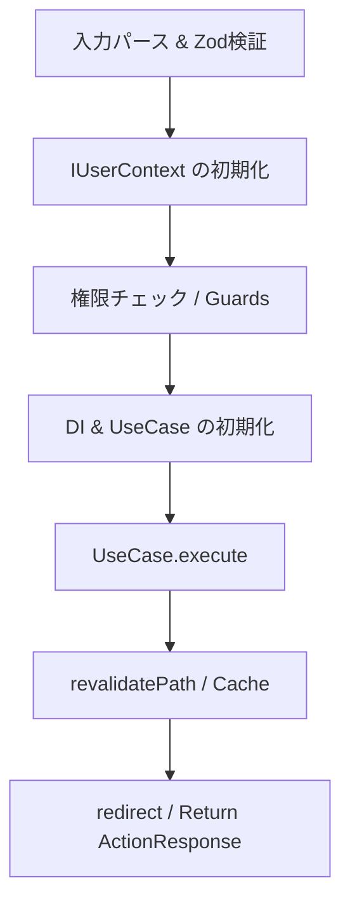

# アクション層 (src/actions)

アクション層は、Next.js の Server Actions を用いて UI からの入力を受け取り、アプリケーション層（UseCase）の機能を呼び出す **インターフェース・アダプター（Interface Adapter）** です。

## 役割

- **リクエストの解釈と検証**: `FormData` や JSON 文字列のパースを行い、Zod 等を用いて入力データの「形」を検証します。
- **認可の執行 (Operation Protection)**: セッション情報を確認し、ユーザーが対象の操作を実行する権限（Role）を持っているかを検証します。
- **コンテキストの解決**: 認証情報や環境パラメータを解決し、アプリケーション層が解釈可能な純粋なオブジェクト（Command）に変換します。
- **ユースケースの呼び出し**: 依存関係を解決（DI）し、ユースケースを実行します。
- **レスポンスの変換**: 実行結果や例外（`AppError`）を UI 用の共通フォーマット（`ActionResponse`）に変換します。
- **キャッシュと遷移**: 成功後に `revalidatePath` によるキャッシュ更新や `redirect()` による画面遷移を行います。

## 実装ルーチン（標準フロー）

Server Action は以下の順序で実装することを推奨します。



## 実装ルール

### 1. 宣言と戻り値

- ファイルの先頭に必ず `'use server'` を記述してください。
- 戻り値は `ActionResponse<T>` 型を使用し、UI 側の `useActionState` (React 19) で初期状態から扱える形式を維持します。

### 2. 認可とセキュリティ (Authorization)

- **多層防御**: `src/proxy.ts` が「経路」を保護するのに対し、アクションは「操作」を保護します。
- **ガード関数の利用**: `src/actions/shared/guards.ts` に定義されたガード関数を使用し、ビジネスロジック実行前に権限を検証してください。

### 3. リダイレクトとキャッシュ更新

- 成功後の `revalidatePath` / `revalidateTag` 呼び出しを忘れないでください。
- `redirect()` は `try-catch` ブロックの**外側**、またはアクションの最後に到達するように記述してください。

## 実装例

```typescript
'use server';

import { z } from 'zod';
import { revalidatePath } from 'next/cache';
import { redirect } from 'next/navigation';
import { ActionResponse } from './shared/action-response';
import { ensureAdmin } from './shared/guards';
import { ServerUserContext } from '@/infrastructure/auth/user-context';
import { UpdateWorkUseCase } from '@/application/work/usecase/update-work.usecase';

const Schema = z.object({ id: z.string().uuid(), title: z.string() });

export async function updateWorkAction(
  prevState: any,
  formData: FormData,
): Promise<ActionResponse<void>> {
  const userContext = new ServerUserContext();

  try {
    // 1. バリデーション
    const raw = JSON.parse(formData.get('data') as string);
    const parsed = Schema.safeParse(raw);
    if (!parsed.success)
      return {
        success: false,
        errorType: 'VALIDATION_ERROR',
        errors: parsed.error.flatten().fieldErrors,
      };

    // 2. 認可チェック (Guard)
    await ensureAdmin(userContext);

    // 3. DI & 実行
    // (実際には DI コンテナ等を使用することを推奨)
    const useCase = new UpdateWorkUseCase(/* dependencies */);
    await useCase.execute(parsed.data);
  } catch (error) {
    if (error instanceof AppError) {
      // エラー変換ロジック...
      return { success: false, errorType: error.code, message: error.message };
    }
    return { success: false, errorType: 'SYSTEM_ERROR', message: '予期せぬエラーが発生しました' };
  }

  // 4. キャッシュ更新と遷移 (try-catch の外側)
  revalidatePath('/admin/works');
  redirect('/admin/works');
}
```

---

## 下位レイヤーとの境界

- **Action層**: UI 技術（Next.js, `FormData`, `redirect`）に依存して良い。認可（操作の可否）を判断する。
- **Application層**: UI 技術に依存しない純粋なドメイン機能を提供する。`IUserContext` を受け取ることはあっても、具体的な認証情報には触れない。
